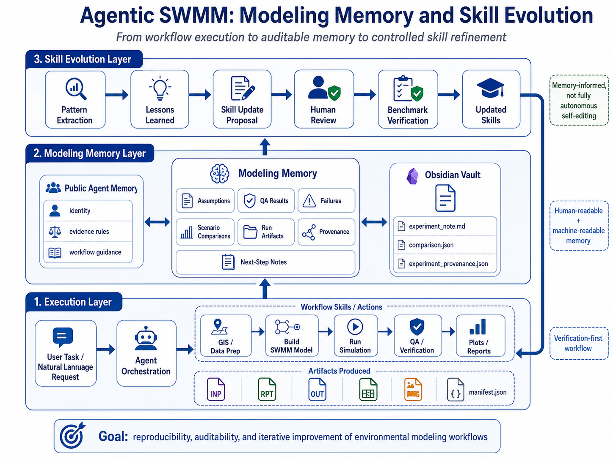
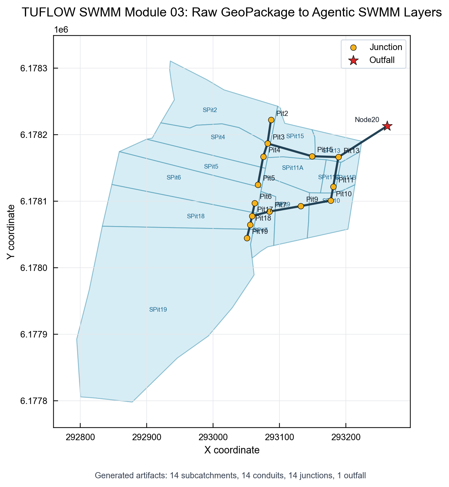
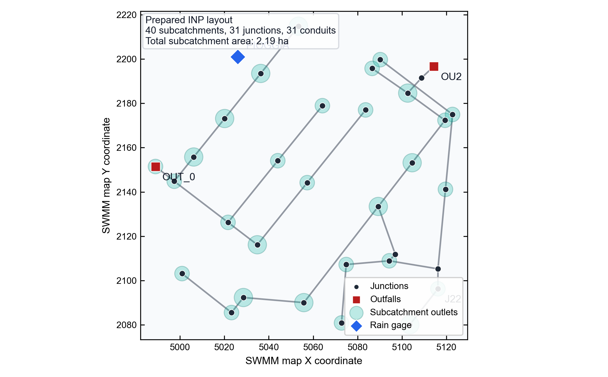
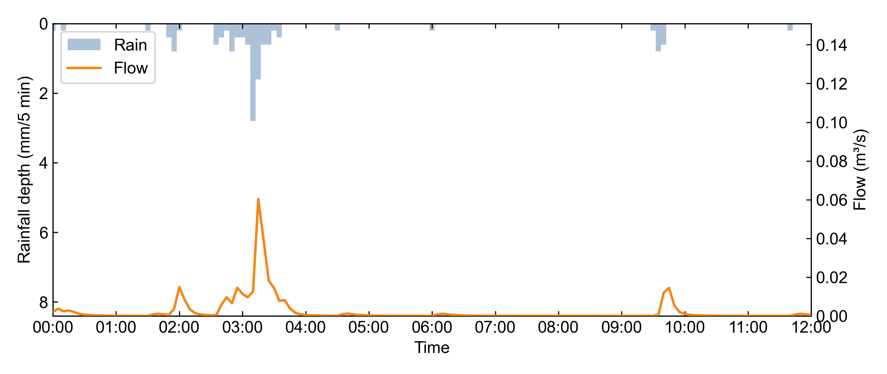
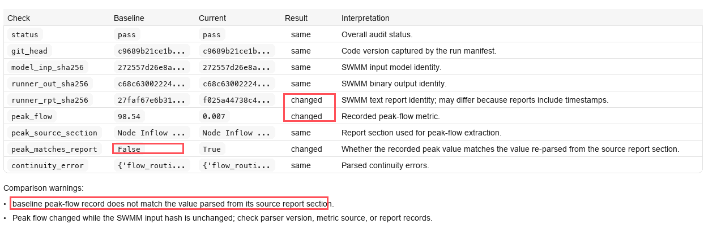

# Agentic SWMM Workflow

<p align="center">
  
</p>

<p align="center">
  <a href="https://github.com/Zhonghao1995/agentic-swmm-workflow/actions/workflows/ci.yml">
    
  </a>
  <a href="https://github.com/Zhonghao1995/agentic-swmm-workflow/releases/latest">
    
  </a>
  <a href="#try-it-in-one-command">
    
  </a>
  <a href="#try-it-in-one-command">
    
  </a>
  <a href="https://github.com/USEPA/Stormwater-Management-Model">
    
  </a>
  <a href="#codex--openclaw--hermes-ready">
    
  </a>
  <a href="LICENSE">
    
  </a>
</p>

**Agentic SWMM for reproducible stormwater modeling**<br>
*[Codex](https://openai.com/codex/), [OpenClaw](https://github.com/openclaw/openclaw), or [Hermes Agent](https://github.com/NousResearch/hermes-agent) + Skills + MCP + SWMM + verification-first workflow + Obsidian-compatible audit*

**A five-minute, one-command EPA SWMM workflow that is auditable, memory-informed, and agent-ready.**

Agentic SWMM Workflow is an open-source, verification-first framework for reproducible stormwater modeling with EPA SWMM. It supports automated execution, QA checks, provenance tracking, calibration support, documentation, and modeling memory, while keeping human modelers in control.

The project is designed to work with agent runtimes such as Codex, OpenClaw, or Hermes. Users can describe a modeling goal in natural language, while SWMM execution remains deterministic, inspectable, and artifact-based.

This is not a simple chat-to-SWMM wrapper. The agent can help coordinate the workflow, but model files, SWMM runs, QA checks, plots, provenance records, audit notes, and modeling memory remain visible as reusable artifacts. Modeling memory can summarize repeated problems and propose skill refinements, but accepted changes still require human review and benchmark verification.

Authors: **Zhonghao Zhang** & **Caterina Valeo**  
License: **MIT**

Paper: [*Agentic Modelling Pipeline: Reproducible Rapid Stormwater Modelling Management System with OpenClaw*](https://doi.org/10.31223/X5F47G)

## Try it in one command

Choose the path that matches your environment.

### Method 1. Docker recommended

Use this when you want the most reproducible path and do not want to install Python packages, SWMM5, Node, or GIS dependencies locally.

```bash
bash -c "$(curl -fsSL https://raw.githubusercontent.com/Zhonghao1995/agentic-swmm-workflow/main/scripts/docker-bootstrap.sh)"
```

Requirements: Docker Desktop or Docker Engine.

### Method 2. macOS / Linux local install

Use this when you want a local development environment.

```bash
bash -c "$(curl -fsSL https://raw.githubusercontent.com/Zhonghao1995/agentic-swmm-workflow/main/scripts/bootstrap.sh)"
```

### Method 3. Windows PowerShell local install

Run PowerShell as Administrator.

```powershell
powershell -NoProfile -ExecutionPolicy Bypass -Command "iex ((New-Object System.Net.WebClient).DownloadString('https://raw.githubusercontent.com/Zhonghao1995/agentic-swmm-workflow/main/scripts/bootstrap.ps1'))"
```

## Why this project exists

Stormwater modelling is rarely one command. A typical SWMM project can involve GIS preprocessing, rainfall formatting, parameter assignment, network assembly, INP construction, model execution, QA checks, plots, calibration, uncertainty analysis, and reporting.

Agentic SWMM provides a middle path: natural-language orchestration with deterministic SWMM execution, explicit provenance, project memory, and verification-first modelling.

**The goal is not to replace SWMM or the modeller, but to make SWMM-based modelling easier to rerun, inspect, remember, and trust.**

## What makes it different

- **One-command onboarding:** install the workflow and SWMM engine with the bootstrap script.
- **Agent-guided, SWMM-grounded:** agents can coordinate tasks, while model execution stays deterministic, inspectable, and CLI-runnable.
- **Modular skill layer:** GIS, climate, building, running, plotting, calibration, uncertainty, audit, and orchestration are separated into reusable modules with MCP interfaces where available.
- **Verification-first provenance:** build, run, audit, and comparison stages emit traceable artifacts before outputs are treated as evidence.
- **Supervised skill evolution:** audited runs can surface recurring workflow patterns and propose updates to existing skills or new skills, while staying coupled to the current skill-driven framework.

## Workflow

<p align="center">
  <a href="docs/figs/modeling_memory_skill_evolution.png">
    
  </a>
</p>

The workflow has three connected layers: execution, modeling memory, and controlled skill evolution. Natural-language requests can trigger reproducible SWMM actions; audited artifacts update human-readable and machine-readable memory; repeated patterns can produce skill-refinement proposals that still require human review and benchmark verification.

## What a run can produce

- generated or supplied SWMM input files such as `model.inp`
- SWMM report and binary outputs such as `.rpt` and `.out`
- manifests, command traces, QA summaries, and parsed peak-flow metrics
- rainfall-runoff figures, calibration summaries, and fuzzy uncertainty summaries
- audit records: `experiment_provenance.json`, `comparison.json`, and `experiment_note.md`
- Obsidian-ready modelling notes and modelling-memory summaries

## Validation snapshot

The repository includes benchmark paths with different evidence boundaries.

### Raw GeoPackage-to-INP benchmark

This path converts public TUFLOW SWMM Module 03 GeoPackage layers into SWMM-ready artifacts before running QA and audit.

<p align="center">
  
</p>

```bash
python3 scripts/benchmarks/run_tuflow_swmm_module03_raw_path.py
```

### Prepared-input SWMM benchmark

This path validates execution, direct SWMM comparison, node-level QA, plotting, and audit artifacts for an external 40-subcatchment SWMM model from the public Tecnopolo dataset. The layout figure is generated from the prepared INP coordinates, conduits, outfalls, rain gage, and subcatchment routing fields; the hydrograph is checked against a direct `swmm5` baseline.

<p align="center">
  
</p>

<p align="center">
  
</p>

```bash
python3 scripts/benchmarks/run_tecnopolo_199401.py
```

### Optional INP-derived raw adapter benchmark

This path fetches a public `generate_swmm_inp` fixture, extracts raw-like GIS/CSV inputs from its open SWMM input file, and runs the Agentic SWMM modular path from those derived inputs.

```bash
python3 scripts/benchmarks/run_generate_swmm_inp_raw_path.py
```

More details: [Validation evidence](docs/validation-evidence.md), [TUFLOW example](examples/tuflow-swmm-module03/README.md), and [Tecnopolo example](examples/tecnopolo/README.md).

## Audit and research memory

The audit layer consolidates artifacts, QA checks, and metric provenance into an Obsidian-compatible experiment note. This example catches a recorded peak-flow value that does not match the value re-parsed from the SWMM report source section.

<p align="center">
  
</p>

The downstream modelling-memory layer can summarize audited run histories into recurring failure patterns, assumptions, missing evidence, QA issues, lessons learned, and controlled proposals for updating existing skills or creating new skills. Because skills drive the workflow, these proposals stay coupled to the current Agentic SWMM framework and still require human review and benchmark verification before acceptance.

More details: [Experiment audit framework](docs/experiment-audit-framework.md) and [Modeling memory and skill evolution](docs/modeling-memory-and-skill-evolution.md).

## Codex / OpenClaw / Hermes ready

Codex can serve as the primary local development runtime for this repository: it can inspect the checkout, run scripts, edit skills, generate audit records, update the local Obsidian vault, and review evidence before claims are accepted.

OpenClaw and Hermes remain compatible orchestration targets, especially for MCP-centered agent runs outside the Codex development environment.

For agent-orchestrated runs, preload the public memory package and then use the top-level end-to-end skill:

```text
openclaw/memory/
skills/swmm-end-to-end/SKILL.md
```

The top-level skill defines when to use the full modular path, when to use the prepared-input path, which QA gates must pass, and when to stop instead of inventing missing inputs.

More details: [Codex runtime path](docs/codex-runtime.md) and [OpenClaw execution path](docs/openclaw-execution-path.md).

## Documentation map

- [Validation evidence](docs/validation-evidence.md) - benchmark scope, commands, audit example, and evidence boundaries
- [Experiment audit framework](docs/experiment-audit-framework.md) - provenance, comparison, and Obsidian note contracts
- [Modeling memory and skill evolution](docs/modeling-memory-and-skill-evolution.md) - controlled memory-to-skill refinement loop
- [Codex runtime path](docs/codex-runtime.md) - local development, audit, Obsidian, and evidence-review workflow
- [OpenClaw execution path](docs/openclaw-execution-path.md) - MCP tool-call sequence for agent runtimes
- [Repository map](docs/repo-map.md) - folder-level walkthrough
- [Calibration example](examples/calibration/README.md) - compact calibration support example

## Where collaborators can help

Contributions are welcome in additional SWMM case studies, stronger calibration and validation workflows, DEM / land-use / soil / drainage-asset workflows, new MCP tools, QA testing, tutorials, and interoperability with GIS, ML, and hydrologic toolchains.

Contact:
- zhonghaoz@uvic.ca
- valeo@uvic.ca

## Citation

GitHub citation metadata is provided in `CITATION.cff`.

### APA repository
Zhang, Z., & Valeo, C. (2026). *agentic-swmm-workflow* [Computer software]. GitHub. https://github.com/Zhonghao1995/agentic-swmm-workflow

### APA manuscript / preprint
Zhang, Z., & Valeo, C. (2026). *Agentic Modelling Pipeline: Reproducible Rapid Stormwater Modelling Management System with OpenClaw*. https://doi.org/10.31223/X5F47G
