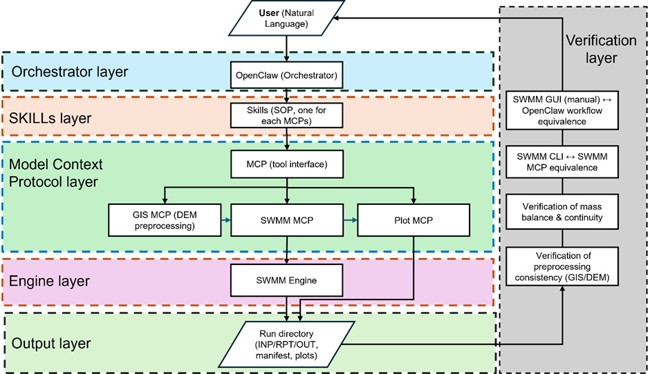

# agentic-swmm-workflow

**Agentic SWMM for reproducible stormwater modeling**  
*OpenClaw or Hermes + Skills + MCP + SWMM + verification-first workflow + Obsidian-compatible audit*

Authors: **Zhonghao Zhang** & **Caterina Valeo**  
License: **MIT**

`agentic-swmm-workflow` is an open-source framework for building **reproducible, agentic SWMM workflows** with **OpenClaw** or **Hermes** as the recommended orchestration layer.
It helps researchers and developers move from scattered scripts and manual clicks to a pipeline that is **structured, auditable, and easier to rerun**.
The audit layer produces Obsidian-compatible experiment notes and can also be run directly from the CLI.

At the core of this project is a simple idea: **use OpenClaw or Hermes to operate a modular SWMM workflow through Skills and MCP tools, while keeping the underlying modeling steps deterministic and inspectable**.
OpenClaw can trigger the audit layer after a run, while the generated Markdown note supports Obsidian as a second-brain review layer.

Unlike a simple chat-to-SWMM wrapper, this repository focuses on the full workflow: **prepare inputs, assemble models, run SWMM, verify outputs, plot results, and calibrate with traceable artifacts**.

## Why this project matters

- **OpenClaw and Hermes ready:** the workflow is designed to be operated through modern agentic runtimes rather than only through ad hoc scripts.
- **End-to-end workflow:** GIS, climate, parameters, network assembly, model build, run, plotting, and calibration in one repo.
- **Reproducible by default:** build/run/calibration stages emit standardized artifacts and `manifest.json` provenance.
- **Verification-first:** continuity, mass-balance, preprocessing consistency, and parsed peak checks are built into execution.
- **Works with or without an agent:** run directly from CLI, or orchestrate with **OpenClaw** or **Hermes**.
- **Made for research and tooling:** clean outputs, deterministic runs, publication-style plots, and modular skill-level interfaces.

## Who this is for

This project is useful if you are:
- a **SWMM user** who wants cleaner and more repeatable workflows,
- a **hydrology or stormwater researcher** exploring reproducible computational pipelines,
- a **developer building AI tools for environmental modeling**, or
- a **collaborator** interested in MCP tools, orchestration, calibration, or hydrologic QA.

## What you can do with it

Implemented capabilities already include:
- **Skills** for GIS, climate, parameters, network assembly, model build, run, plotting, and calibration.
- A top-level **`swmm-end-to-end` orchestration skill** for OpenClaw-facing build/run/QA flows.
- **MCP servers** for each module, enabling tool-level orchestration in OpenClaw.
- **Manifest-driven provenance and audit notes:** stages emit `manifest.json`, while the audit layer consolidates artifacts into `experiment_provenance.json`, `comparison.json`, and Obsidian-compatible `experiment_note.md`.
- **Verification checks** for continuity/mass balance, preprocessing consistency, and extracted peak metrics.
- **Calibration loop support** with explicit candidate sets and bounded search (`random`, `lhs`, `adaptive`).
- **Direct CLI execution** for deterministic, script-first runs without requiring an orchestrator.

## Architecture

<p align="center">
  <a href="docs/figs/openclaw_swmm_pipeline.pdf">
    
  </a>
</p>

*(Click the figure to open the PDF version.)*

**Layers (left → right):**
- **Orchestrator layer:** OpenClaw (optional; coordinates tools and steps)
- **Skills layer:** SOP-style Skills describing how each tool should be run safely and reproducibly
- **MCP layer:** tool interfaces (GIS / Climate / Params / Network / Builder / SWMM / Plot / Calibration)
- **Engine layer:** SWMM engine (`swmm5`)
- **Output layer:** standardized run directory (`INP/RPT/OUT`, manifest, plots, summaries)
- **Verification layer:** checks for equivalence, continuity, and preprocessing consistency

## Experiment Audit Example

The audit layer consolidates artifacts, QA checks, and metric provenance into an Obsidian-compatible experiment note. This example catches a recorded peak-flow value that does not match the value re-parsed from the SWMM report source section.

<p align="center">
  
</p>

For agent-orchestrated runs, use a high-reasoning coding model and inspect the generated audit note before treating outputs as research evidence.

## External multi-subcatchment benchmark

The repository includes a compact Tecnopolo prepared-input benchmark derived from a public Zenodo SWMM dataset. It verifies that the workflow can execute and audit an external **40-subcatchment** SWMM model, compare `swmm-runner` outputs against direct `swmm5` execution, check both an outfall and an internal junction, and generate rainfall-runoff figures.

<p align="center">
  
</p>

```bash
python3 scripts/benchmarks/run_tecnopolo_199401.py
```

See `examples/tecnopolo/README.md` for the validation details, expected peak-flow checks, reproducibility notes, and the boundary that this benchmark validates the prepared-input path rather than raw GIS-to-INP construction.

## Raw GeoPackage-to-INP benchmark

The TUFLOW SWMM Module 03 benchmark verifies the structured raw GIS path: public GeoPackage layers are extracted into junctions, outfalls, conduits, subcatchments, multi-raingage rainfall inputs, `network.json`, `subcatchments.csv`, parameter JSON, a generated `model.inp`, SWMM run outputs, continuity/peak QA, and an audit note.

```bash
python3 scripts/benchmarks/run_tuflow_swmm_module03_raw_path.py
```

See `examples/tuflow-swmm-module03/README.md` for setup, expected artifacts, metrics, and the evidence boundary.

## Quickstart

### One-command install (macOS / Linux)

```bash
bash -c "$(curl -fsSL https://raw.githubusercontent.com/Zhonghao1995/agentic-swmm-workflow/main/scripts/bootstrap.sh)"
```

This bootstrap command:
- clones or updates the repository into `./agentic-swmm-workflow`,
- installs missing system dependencies where supported,
- installs Python and MCP dependencies, and
- installs or builds the SWMM engine if `swmm5` is not already available.

On macOS / Linux, the installer builds the SWMM solver from the official [USEPA/Stormwater-Management-Model](https://github.com/USEPA/Stormwater-Management-Model) source repository when a local `swmm5` command is missing.

### One-command install (Windows PowerShell, run as Administrator)

```powershell
powershell -NoProfile -ExecutionPolicy Bypass -Command "iex ((New-Object System.Net.WebClient).DownloadString('https://raw.githubusercontent.com/Zhonghao1995/agentic-swmm-workflow/main/scripts/bootstrap.ps1'))"
```

This bootstrap command:
- clones or updates the repository into `.\agentic-swmm-workflow`,
- installs Chocolatey if needed,
- installs Git, Python, Node.js LTS, and SWMM,
- installs Python and MCP dependencies, and
- creates a `swmm5` command shim when the Windows SWMM installer exposes a different executable name.

### Install after clone

```bash
bash scripts/install.sh --yes
source .venv/bin/activate
```

On Windows after cloning:

```powershell
powershell -ExecutionPolicy Bypass -File .\scripts\install.ps1 -Yes
.\.venv\Scripts\Activate.ps1
```

### Python requirements

The Python install now covers both the acceptance path and the real-data Tod Creek smoke test, including:
- `pandas`
- `numpy`
- `matplotlib`
- `rasterio`
- `pyshp`
- `pysheds`
- `swmmtoolbox`

### Run the acceptance pipeline

```bash
python3 scripts/acceptance/run_acceptance.py --run-id latest
```

### Check the acceptance report

Open:

`runs/acceptance/latest/acceptance_report.md`

### Audit a run

```bash
python3 skills/swmm-experiment-audit/scripts/audit_run.py --run-dir runs/acceptance/latest
```

Add `--obsidian-dir <vault-folder>` to write a copy of the note into Obsidian.

### Make a rainfall-runoff plot from acceptance outputs

```bash
mkdir -p runs/acceptance/latest/07_plot
python3 skills/swmm-plot/scripts/plot_rain_runoff_si.py \
  --inp runs/acceptance/latest/04_builder/model.inp \
  --out runs/acceptance/latest/05_runner/acceptance.out \
  --out-png runs/acceptance/latest/07_plot/fig_rain_runoff.png
```

## End-to-end flow

1. Prepare deterministic inputs (GIS polygons, rainfall series, mapped soil/landuse parameters, and network schema/import).
2. Assemble a runnable SWMM `.inp` with `swmm-builder` and emit a build manifest.
3. Execute SWMM with `swmm-runner` and emit run-level manifest plus parsed diagnostics.
4. Verify continuity and extracted peak behavior.
5. Produce publication-style rainfall-runoff plots.
6. Optionally calibrate and validate with explicit sets or bounded search.

## Repository map

```text
agentic-swmm-workflow/
├─ README.md
├─ docs/
│  ├─ figs/openclaw_swmm_pipeline.{png,pdf}
│  └─ repo-map.md
├─ examples/
│  ├─ todcreek/model_chicago5min.inp
│  ├─ tuflow-swmm-module03/
│  ├─ tecnopolo/
│  └─ calibration/
├─ scripts/
│  ├─ bootstrap.sh
│  ├─ bootstrap.ps1
│  ├─ install.sh
│  ├─ install.ps1
│  ├─ benchmarks/run_tecnopolo_199401.py
│  ├─ benchmarks/run_tuflow_swmm_module03_raw_path.py
│  ├─ acceptance/run_acceptance.py
│  └─ real_cases/run_todcreek_minimal.py
├─ skills/
│  ├─ swmm-gis/
│  ├─ swmm-climate/
│  ├─ swmm-params/
│  ├─ swmm-network/
│  ├─ swmm-builder/
│  ├─ swmm-runner/
│  ├─ swmm-plot/
│  ├─ swmm-calibration/
│  ├─ swmm-uncertainty/
│  ├─ swmm-experiment-audit/
│  └─ swmm-end-to-end/
└─ runs/ (generated artifacts)
```

For more detail:
- See `docs/repo-map.md` for a broader repo walkthrough.
- See `skills/<module>/SKILL.md` for module-specific behavior and examples.
- Each module can expose an MCP server at `skills/<module>/scripts/mcp/server.js` for optional OpenClaw integration.

### Fuzzy uncertainty propagation

`skills/swmm-uncertainty/` adds a CLI-first framework for epistemic parameter uncertainty. Users define triangular or trapezoidal membership functions in `fuzzy_space.json`; compact triangular specs use the current model parameter value as the default peak. The tool resolves alpha-cut intervals, samples parameter combinations, runs SWMM, and summarizes output envelopes by alpha level.

Dry-run example:

```bash
python3 skills/swmm-uncertainty/scripts/uncertainty_propagate.py \
  --base-inp examples/todcreek/model_chicago5min.inp \
  --patch-map examples/calibration/patch_map.json \
  --fuzzy-space skills/swmm-uncertainty/examples/fuzzy_space.json \
  --config skills/swmm-uncertainty/examples/uncertainty_config.json \
  --run-root runs/uncertainty-demo \
  --summary-json runs/uncertainty-demo/uncertainty_summary.json \
  --dry-run
```

## OpenClaw orchestration

If you want one OpenClaw-facing entrypoint instead of manually choosing module skills, start with:

`skills/swmm-end-to-end/SKILL.md`

That top-level skill defines:
- when to use the full modular path,
- when to fall back to the Tod Creek minimal real-data runner,
- which QA gates must pass before a run is considered usable, and
- when to stop instead of inventing missing network/subcatchment inputs.

For the exact MCP tool-call sequence behind that skill, see:

`docs/openclaw-execution-path.md`

## Where collaborators can help

Contributions are especially welcome in:
- additional SWMM case studies and benchmark datasets,
- stronger calibration and validation workflows,
- new MCP tools and orchestration patterns,
- QA and regression testing,
- documentation, tutorials, and onboarding examples,
- interoperability with GIS, ML, and hydrologic toolchains.

If you are interested in collaborating, opening an issue or reaching out by email is welcome.

Contact:
- zhonghaoz@uvic.ca
- valeo@uvic.ca

## Roadmap

Planned or actively explored directions include:
- improved benchmark and acceptance cases,
- richer calibration agents and search strategies,
- stronger report generation and experiment summaries,
- broader GIS and data-ingestion tooling,
- cleaner onboarding for external contributors,
- deeper reproducibility and equivalence testing.

## Citation

### APA (repository)
Zhang, Z., & Valeo, C. (2026). *agentic-swmm-workflow* [Computer software]. GitHub. https://github.com/Zhonghao1995/agentic-swmm-workflow

### APA (manuscript / preprint)
Zhang, Z., & Valeo, C. (2026). *Agentic Modelling Pipeline: Reproducible Rapid Stormwater Modelling Management System with OpenClaw*. https://doi.org/10.31223/X5F47G
