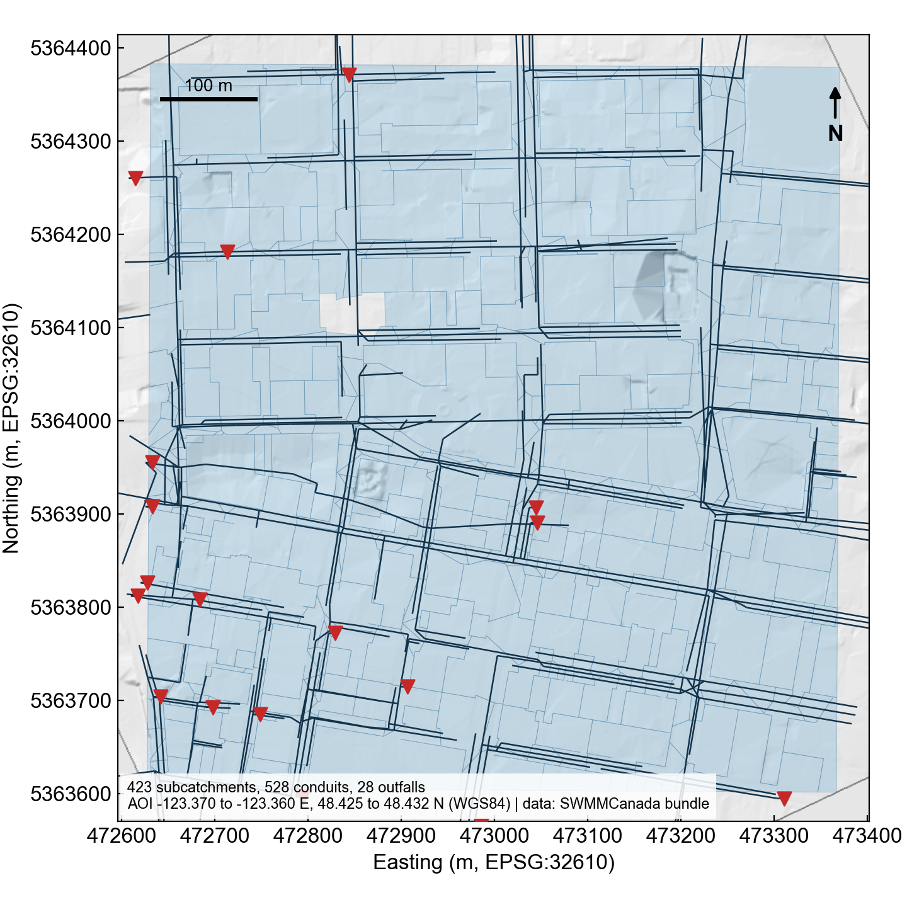
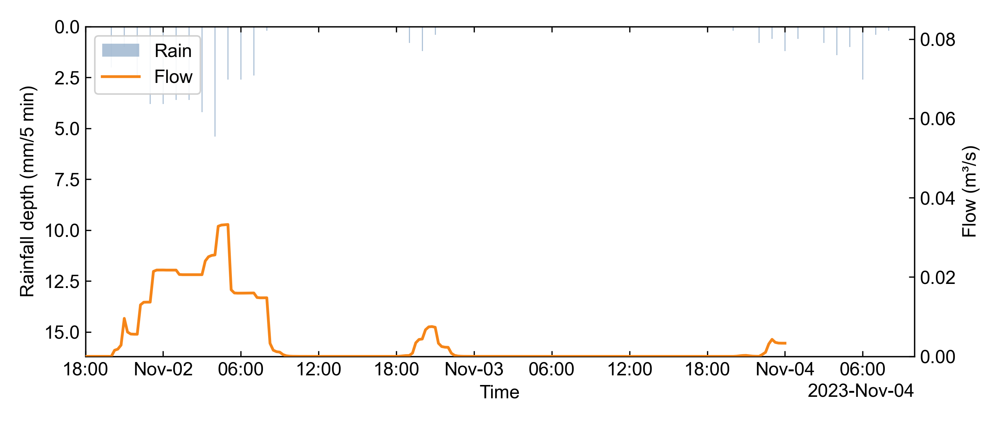
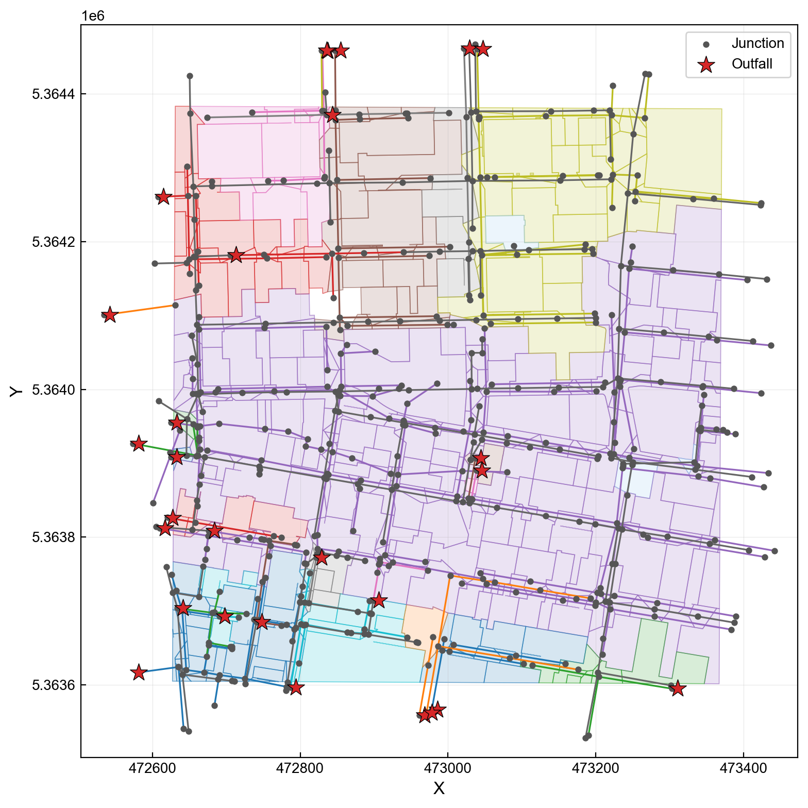

# Downtown Victoria, BC: one prompt to a client-ready Word report

One English sentence typed into `aiswmm`. The agent fetched the real municipal storm network for downtown Victoria from [SWMMCanada](https://github.com/Zhonghao1995/SWMMCanada), simulated a November storm, audited the run, screened it against the design rulebook, plotted the rainfall-runoff response, drew the network map, and exported a Word report with the figures embedded. One confirmation keypress. Everything landed in a single run directory.

## The prompt

```text
Fetch a SWMM model from the Canada service for downtown Victoria BC, rainfall period
November 1 to November 4 2023. Run the model, audit it, review it against the design
rulebook, plot the rainfall and runoff hydrograph, and export a client Word report
with the figures included.
```

No coordinates, no file paths, no tool names. The downtown Victoria demo boundary is a documented default, so the agent proceeds directly; for any other area it asks for a bounding box first (see "Try your own area" below).

## What the agent did

1. **Fetched** the real Victoria municipal storm network for the demo boundary through the SWMMCanada service, with the requested rainfall window attached as forcing.
2. **Ran** SWMM on the fetched model.
3. **Audited** the run: continuity errors, solver status, artifact completeness.
4. **Reviewed** it against the deterministic design rulebook.
5. **Plotted** the rainfall-runoff hydrograph at the peak-inflow node and drew the network map.
6. **Exported** a client Word report with the figures embedded.

Session excerpt (abridged):

```text
you> Fetch a SWMM model from the Canada service for downtown Victoria BC, ...
aiswmm> Session: codex (gpt-5.6-sol) -> runs/2026-08-09/191335_downtown-victoria-bc_run
aiswmm> [18] fetch_swmm_from_canada  -> [Y/n]: Y  (Real municipal network: Victoria, BC)
aiswmm> [20] run_swmm_inp   ok
aiswmm> [22] audit_run      ok
aiswmm> [24] review_run     ok  Design review: FAIL (1 pass, 2 fail, 4 warn, 4 needs-data)
aiswmm> [27] plot_run       ok
aiswmm> [28] map_run        ok
aiswmm> [31] generate_report ok  Report written to: .../report.docx
```

## The numbers

| Quantity | Value |
| --- | --- |
| Network | 423 subcatchments, 325 storm nodes, 307 storm conduits |
| Rainfall forcing | 50.0 mm total, November 1 to 4, 2023 |
| SWMM run | Completed, no solver errors |
| Peak node inflow | 0.033 m3/s at node DOF007021, hour 05:00 |
| Continuity error (runoff) | -0.098 % |
| Continuity error (routing) | 0.371 % |
| Audit | Passed |
| Design review | FAIL: 1 pass, 2 fail, 4 warnings, 4 needs-data (expected for an uncalibrated first pass) |
| User keystrokes after the prompt | One Y |
| LLM usage | 17 calls, about 354k tokens end to end |

## The figures

Study area fetched from SWMMCanada (DEM hillshade, subcatchments, conduits, outfalls):



Rainfall-runoff response at the peak-inflow node:



Network map of the fetched storm system:



## The deliverable

[sample_report.docx](sample_report.docx) is the Word report exactly as the agent wrote it: cover, run summary, model description read from the INP itself, QA gates, embedded figures, provenance hashes, numbered tables and captions. Open it in Word; nothing was edited afterwards.

## Where everything landed

```text
runs/2026-08-09/191335_downtown-victoria-bc_run/
  00_raw/          SWMMCanada input bundle + study area map
  05_builder/      model.inp as fetched
  06_runner/       model.rpt, model.out
  08_plot/         hydrograph, network map
  09_audit/        audit evidence
  10_upstream/     upstream bundle, kept verbatim
  11_review/       design_review.md
  report.docx      the Word deliverable
  final_report.md  the agent's own summary of the turn
  agent_trace.jsonl  append-only event log of every tool call
```

One run directory, numbered stages, self-describing session. The trace is the receipt: every tool call, argument, and result is on the record.

## Honest boundaries

- This is an **uncalibrated first-pass model**. The design review FAIL is the rulebook screening doing its job on exactly such a model, not a workflow failure. Calibrate against observed flow before using results for design decisions.
- The design review is a deterministic rulebook screening, not certification of local regulatory compliance.
- The demo boundary is for demonstration. Replace it with your project's actual study boundary for engineering use.

## Try your own area

Install (macOS / Linux):

```bash
curl -fsSL https://aiswmm.com/install.sh | bash
```

Then launch `aiswmm` and adapt the prompt. With your own bounding box the chain runs directly:

```text
Fetch a SWMM model from the Canada service for the James Bay area of Victoria BC,
bbox [-123.383, 48.414, -123.371, 48.423], rainfall period November 1 to
November 4 2023. Run it, audit it, plot the hydrograph, and export a Word report.
```

Name an area without coordinates and the agent asks for a bounding box, then continues the same session with your answer:

```text
Fetch a SWMM model from the Canada service for the Esquimalt area of Victoria BC,
rainfall period November 1 to November 4 2023. Run the model, audit it, plot the
hydrograph, and export a Word report.
```

Inside Canada, SWMMCanada serves real municipal storm networks for 35 cities and synthesizes elsewhere in the country from Canadian open data. Outside Canada, [SWMManywhere](https://github.com/ImperialCollegeLondon/SWMManywhere)-based synthesis covers the rest of the globe. Pick a late-autumn or winter rainfall window on the BC coast; summer windows are often dry and the product will honestly report zero runoff.
