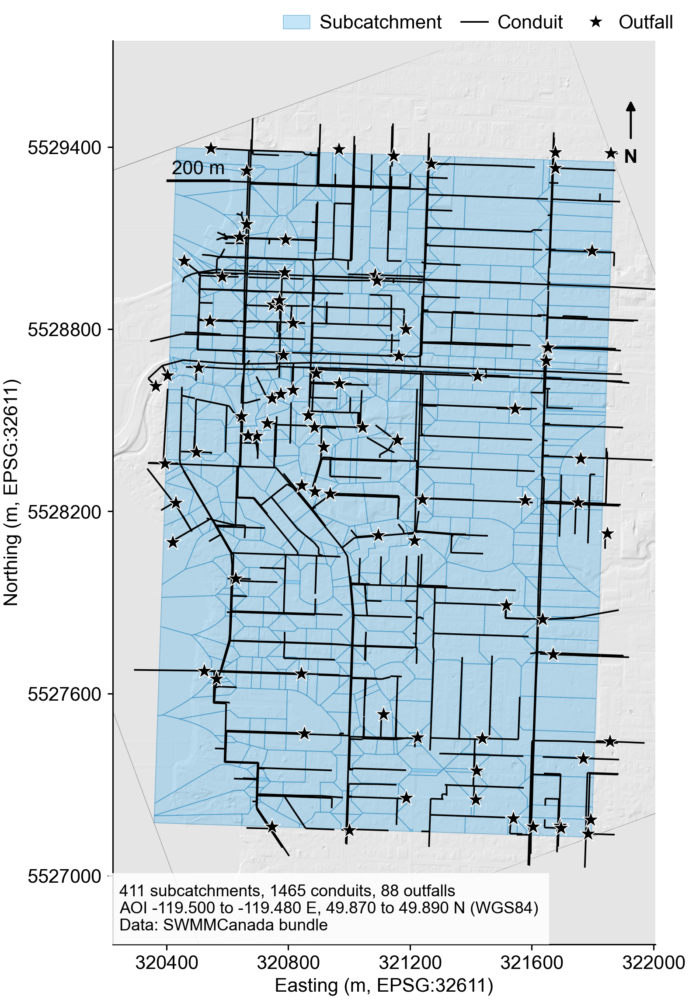
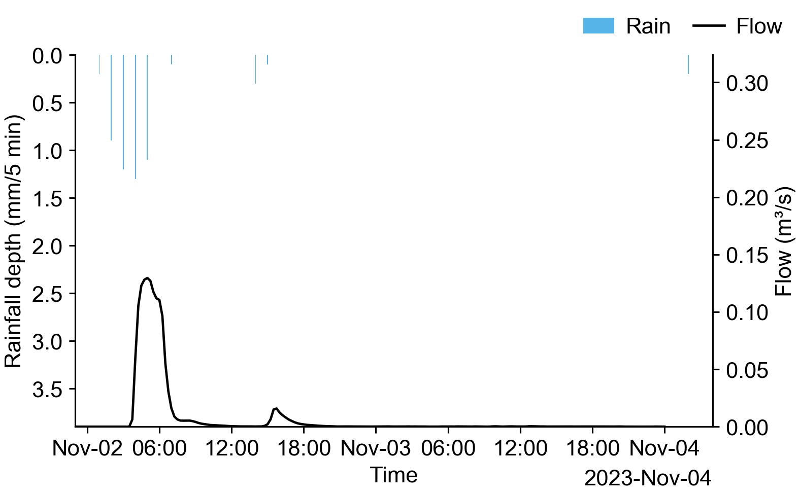

# Kelowna, BC: one sentence to a finished stormwater model

This example is a complete record of a single interactive session. A user typed
one sentence in plain English, approved one tool call, and received a runnable
SWMM model of a real municipal network, a completed simulation, an audit, and a
Word report. Every number below comes from the artifacts in this directory.

The point of the example is not the model. It is the path: what the runtime
decides on its own, what it asks permission for, and what it tells you before
you trust the answer.

## The prompt

```text
Do the whole job for downtown Kelowna BC, rainfall period November 1 to
November 4 2023: get the model, run it, audit it and write the report,
in one go.
```

That is the whole input. No bounding box, no file paths, no flags, no follow-up
questions from the runtime.

## The study area



The service returns this figure with the model bundle. The area is the block of
downtown Kelowna inside the approved bounding box, drawn in UTM zone 11N
(EPSG:32611) over the Canadian 1 m LiDAR surface the network was derived from.

Read the annotation carefully, because it counts the whole bundle: 1465 conduits
and 88 outfalls across both the storm and the sanitary system. The SWMM model
that ran, and the one committed here, is the storm system alone: 832 conduits,
889 nodes, 76 outfalls. The sanitary network travels with the bundle and is not
part of this simulation.

## What the runtime did

The planner selected four skills in sequence and called one tool from each. The
full conversation is in [session_transcript.md](session_transcript.md).

| Step | Skill | Tool | Approval |
|---|---|---|---|
| 1 | `swmm-canada` | `fetch_swmm_from_canada` | asked, and the prompt named the area and the dates |
| 2 | `swmm-runner` | `run_swmm_inp` | auto (read-only against the fetched model) |
| 3 | `swmm-experiment-audit` | `audit_run` | auto |
| 4 | `swmm-report` | `generate_report` | auto |

One approval for the whole job, because one step reaches outside the machine.
The other three work on files the session already owns.

Cost of the first turn: 392 seconds wall clock, 9 model calls, about 129,000
tokens. Most of the wall clock is the upstream service deriving the network.

The runtime resolved "downtown Kelowna BC" to a bounding box inside the
published Kelowna coverage area on its own, and the approval prompt showed that
box before anything left the machine:

```text
Run fetch_swmm_from_canada (bbox [-119.500, 49.870, -119.480, 49.890],
2023-11-01..2023-11-04)? [Y/n]
```

## The model that came back

A real published municipal network for Kelowna, British Columbia, delivered by
the SWMMCanada service (generator version 0.5.0). Provenance is in
[upstream_manifest.json](upstream_manifest.json).

| | |
|---|---|
| Subcatchments | 411 |
| Storm network, simulated here | 889 nodes, 832 conduits, 76 outfalls |
| Sanitary network, in the bundle only | 640 nodes, 633 conduits |
| Terrain | Canadian HRDEM LiDAR, BC Okanagan 2018, 1 m |
| Rainfall | Environment Canada station 1123996 (KELOWNA UBCO), hourly, 100 percent coverage, 6.1 mm over the window |
| Coordinate system | UTM zone 11N. Node N1 sits at 49.890 N, 119.480 W, in downtown Kelowna |

The subcatchments are derived, not municipal source data. The upstream method is
`junction_street_segment`, meaning each node takes the street it fronts, and the
service reports its own confidence in that delineation as medium. The pipes and
nodes are the real published network.

## The results

Simulated 2023-11-01 00:00 to 2023-11-04 00:00, dynamic wave routing, curve
number infiltration, 5 second routing step, SWMM 5.2.4. Evidence for every row
is in [report_excerpt.txt](report_excerpt.txt).

| Result | Value |
|---|---|
| Peak flow at the principal outfall OUT_N467 | 0.130 m3/s |
| System peak outflow, all outfalls | 0.706 m3/s |
| Total external outflow | 6.866 million litres |
| Catchment average precipitation applied | 5.200 mm |
| Surface runoff | 2.499 mm |
| Runoff continuity error | -0.078 percent |
| Flow routing continuity error | -1.022 percent |
| Audit status | pass, 3 checks, 0 failures |



The rain falls in short bursts before dawn on 2 November. The network answers
about an hour later with a single sharp peak of 0.130 m3/s, then drains back to
almost nothing within four hours and stays there for the remaining two days. A
1 km downtown catchment on 5 mm of rain behaves exactly like this, which is the
first thing to check before trusting any of the numbers above.

The two precipitation figures answer different questions and both belong here.
The station recorded 6.1 mm across the requested days. SWMM reports 5.200 mm as
the catchment average depth applied inside the simulation window, which closes
at 2023-11-04 00:00 and therefore excludes what fell later that day.

Both continuity errors sit well inside the range EPA SWMM treats as acceptable,
so the numerical solution is sound. That is a statement about the solver, not
about whether the model represents Kelowna correctly.

## What the runtime told the user to check

The second turn asked where the report is and what to check first. The runtime
did not describe the result as decision ready. It named four things, all of them
traceable to the artifacts:

1. This is a first pass, uncalibrated model. No observed flow supports it.
2. The upstream QA raised two warnings, both visible in
   [upstream_validation.json](upstream_validation.json): 10 conduits run uphill
   (maximum rise 2.93 m), and 5 subcatchments route more than 50 m to their
   outlet.
3. The audit's own diagnostics flag the same conduits by name, with the node
   inverts to inspect.
4. For design use, correct the flagged geometry and calibrate against observed
   flow or level data.

This is the behaviour the example is meant to show. The runtime produced a
finished deliverable and, in the same breath, said what would make it wrong.

## Reproduce it

**From the upstream service**, which is what the transcript shows. Point the
runtime at a SWMMCanada deployment, start the shell, and type the prompt at the
top of this file:

```bash
export AISWMM_SWMMCANADA_URL=https://your-swmmcanada-host
aiswmm
```

**Offline, from the model shipped here.** The fetched model is committed, so the
simulation, the audit and the report reproduce with no network access:

```bash
aiswmm run --inp examples/kelowna-end-to-end/model.inp --run-dir runs/kelowna-example
```

The peak, the continuity errors and the outfall table match `report_excerpt.txt`
exactly. That command was run against this committed model to check it.

The hydrograph above redraws from the same run:

```bash
aiswmm plot --run-dir runs/kelowna-example --node OUT_N467 \
  --node-attr Total_inflow --rain-ts rain --rain-kind depth_mm_per_dt
```

## Try your own area

Point the runtime at a SWMMCanada deployment and name any published city. The
service covers 35 Canadian municipalities; this case used one sentence and one
approval. The upstream service is only needed to build a
model for an area that is not already committed here.

## Files

| File | What it is |
|---|---|
| `model.inp` | The fetched SWMM model, runnable as is |
| `upstream_manifest.json` | Where the network, terrain and rainfall came from, with checksums |
| `upstream_validation.json` | The upstream QA verdict, including the two warnings |
| `report_excerpt.txt` | The SWMM report sections behind every number above |
| `session_transcript.md` | The session as it ran, both turns |
| `study_area.png` | The study area figure the service ships with the bundle |
| `rainfall_runoff_hydrograph.png` | Rainfall and the outfall hydrograph, drawn by `aiswmm plot` |
| `sample_report.docx` | The Word report exactly as the agent wrote it |

Both figures follow the specification the plotting skill applies to every chart
it draws: 450 dpi raster preview, vector master, single-column width.

The binary SWMM output is not committed. It regenerates from `model.inp` in
under a minute.

## The deliverable

[sample_report.docx](sample_report.docx) is the Word report as the agent wrote
it, nothing edited afterwards: cover, run summary, model description read from
the INP, QA gates, the embedded study area figure, provenance hashes, numbered
tables and captions.

## Data sources

The network, terrain and rainfall are derived from Canadian public data:
HRDEM LiDAR elevation for the BC Okanagan, land cover, and Environment and
Climate Change Canada hourly station records. The SWMMCanada service assembles
them into a SWMM model. Check the licence terms of each source before using a
derived model in published work.
