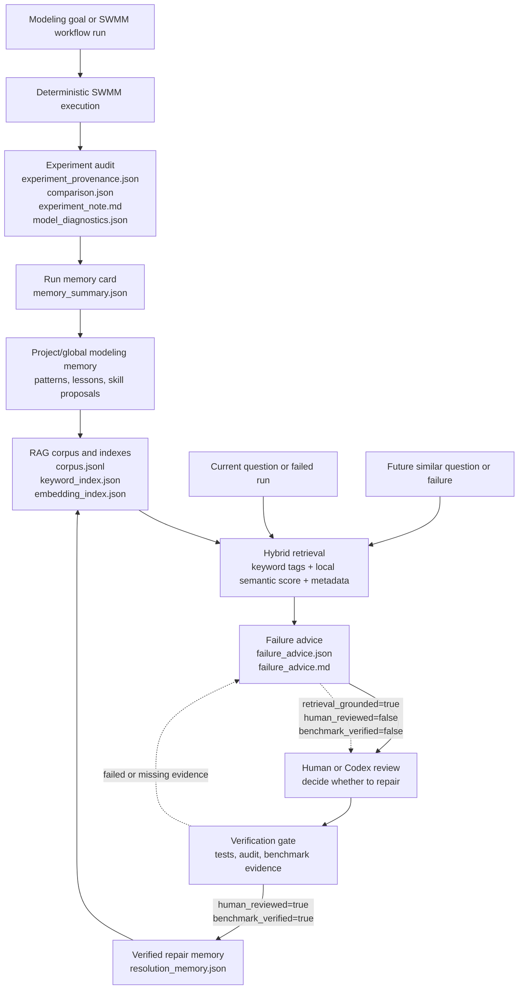

# Obsidian-Compatible RAG Memory

Agentic SWMM now separates two memory actions:

- `swmm-modeling-memory` summarizes audited run history after experiments.
- `swmm-rag-memory` retrieves relevant historical memory for a current question.

This turns the existing audit-based modeling memory into a query-time RAG layer without requiring a vector database.

## System Flow



The diagram shows the core boundary: retrieval can generate advice, but advice does not become reusable repair memory until review and benchmark verification are recorded.

## Current Scope

The first implementation is keyword and tag based. It retrieves over:

- `memory/modeling-memory/modeling_memory_index.json`
- `memory/modeling-memory/run_memory_summaries.json` when present
- `memory/modeling-memory/*.md`
- `memory/modeling-memory/projects/*/project_memory.{json,md}`
- `runs/**/memory_summary.json`
- `runs/**/experiment_note.md`
- `runs/**/model_diagnostics.json`
- `runs/**/failure_advice.{json,md}`
- `runs/**/resolution_memory.json`

The retriever gives extra weight to deterministic Agentic SWMM fields such as failure patterns, model diagnostic ids, project keys, run ids, and case names. This is intentional: tags like `peak_flow_parse_missing`, `continuity_error_high`, and `missing_rpt` should not depend only on semantic similarity.

## Build a Corpus

```bash
python3 skills/swmm-rag-memory/scripts/build_memory_corpus.py \
  --memory-dir memory/modeling-memory \
  --runs-dir runs \
  --out-dir memory/rag-memory
```

Outputs:

- `memory/rag-memory/corpus.jsonl`
- `memory/rag-memory/keyword_index.json`
- `memory/rag-memory/embedding_index.json`

The current embedding backend is `local-hashed-token-char-ngram`. It is deterministic and has no API key or extra package dependency. It is a local semantic-retrieval scaffold, not a large language model embedding. It can later be replaced by a sentence-transformer or another embedding model without changing the corpus contract.

## Retrieve Historical Memory

```bash
python3 skills/swmm-rag-memory/scripts/retrieve_memory.py \
  --query "peak flow parsing is missing" \
  --memory-dir memory/modeling-memory \
  --runs-dir runs \
  --top-k 5
```

Hybrid retrieval with the generated index:

```bash
python3 skills/swmm-rag-memory/scripts/retrieve_memory.py \
  --query "peak flow was not parsed from the report" \
  --index-dir memory/rag-memory \
  --retriever hybrid \
  --top-k 5
```

Each result includes:

- score
- keyword score
- semantic score
- metadata score
- source type
- source path
- run id when available
- project key when available
- failure patterns
- model diagnostic ids
- matched terms
- evidence excerpt

## Generate an LLM Context Pack

```bash
python3 skills/swmm-rag-memory/scripts/answer_with_memory.py \
  --query "Why does high continuity error keep recurring?" \
  --memory-dir memory/modeling-memory \
  --runs-dir runs \
  --top-k 6
```

The output is Markdown that can be passed to Codex, OpenClaw, Hermes, or another LLM. It includes answer constraints that require source paths, run ids, and explicit evidence boundaries.

## Optional Obsidian Export

```bash
python3 skills/swmm-rag-memory/scripts/answer_with_memory.py \
  --query "How should I investigate missing peak-flow parsing?" \
  --memory-dir memory/modeling-memory \
  --runs-dir runs \
  --obsidian-dir "$HOME/Documents/Agentic-SWMM-Obsidian-Vault/10_Memory_Layer/RAG Queries"
```

This writes a query note into the selected Obsidian folder. Obsidian remains the human-readable memory notebook; `memory/rag-memory/` is the machine retrieval layer.

## Evidence Boundary

Retrieved memory is historical context, not proof of a new SWMM result. Answers based on this layer should distinguish:

- confirmed audit evidence,
- deterministic diagnostics,
- repeated historical failure patterns,
- inferred next steps.

The retriever does not modify SWMM inputs, audited runs, benchmark behavior, or skill definitions.

## Failure Advice and Resolution Memory

The safe repair loop is:

```text
SWMM run
-> audit_run.py records facts
-> summarize_memory.py writes memory_summary.json
-> build_memory_corpus.py refreshes memory/rag-memory
-> generate_failure_advice.py writes failure_advice.{json,md} only when trigger conditions are met
-> human or Codex decides whether to repair
-> verification runs
-> record_resolution_memory.py writes resolution_memory.json
-> build_memory_corpus.py refreshes memory/rag-memory again
```

The same post-audit sequence can be run with one command:

```bash
python3 skills/swmm-rag-memory/scripts/refresh_after_run.py \
  --run-dir runs/<case> \
  --runs-dir runs \
  --memory-dir memory/modeling-memory \
  --rag-dir memory/rag-memory
```

This command does not run SWMM and does not repair anything. By default, it rebuilds the RAG index from existing memory, generates failure advice only when conservative trigger conditions are met, and then rebuilds the index if advice was written.

It does not regenerate curated `memory/modeling-memory` outputs unless this explicit flag is provided:

```bash
--refresh-modeling-memory
```

That flag is intentionally opt-in because full modeling-memory regeneration can remove records that are not discoverable from the current audit-file scan.

Generate failure advice:

```bash
python3 skills/swmm-rag-memory/scripts/generate_failure_advice.py \
  --run-dir runs/<case> \
  --index-dir memory/rag-memory \
  --retriever hybrid
```

This writes:

- `runs/<case>/failure_advice.json`
- `runs/<case>/failure_advice.md`

The advice file is explicitly marked:

```json
{
  "retrieval_grounded": true,
  "human_reviewed": false,
  "benchmark_verified": false
}
```

Record verified repair memory:

```bash
python3 skills/swmm-rag-memory/scripts/record_resolution_memory.py \
  --run-dir runs/<case> \
  --action-taken "Updated runner parser to read Node Inflow Summary." \
  --file-changed skills/swmm-runner/scripts/run_swmm.py \
  --verification "python3 -m pytest tests/test_swmm_runner_peak_parser.py" \
  --human-reviewed \
  --benchmark-verified
```

This writes `runs/<case>/resolution_memory.json`. It is treated as reusable repair memory only when both review gates are true:

```json
{
  "human_reviewed": true,
  "benchmark_verified": true
}
```

## Automatic Trigger Conditions

Failure advice is generated only when one or more conservative trigger conditions are present:

- audit status is not pass,
- QA status is not pass,
- comparison mismatch exists,
- model diagnostics are warning or fail,
- detected failure patterns are not `no_detected_failure`,
- missing evidence exists,
- warnings exist,
- stderr evidence exists.

Successful clean runs do not need advice by default.

## Retriever Modes

`keyword` is the default for direct evidence tags. It is best when the question contains known Agentic SWMM terms such as `peak_flow_parse_missing`, `missing_rpt`, or `continuity_error_high`.

`hybrid` combines:

- keyword and deterministic tag matches,
- local hashed n-gram embedding similarity,
- project/run/diagnostic metadata weighting,
- small SWMM-domain query expansions, for example mapping natural peak-flow or continuity-balance wording to deterministic tags such as `peak_flow_parse_missing` or `continuity_error`.

Use `hybrid` when the question is phrased naturally and may not contain the exact failure-pattern id.
