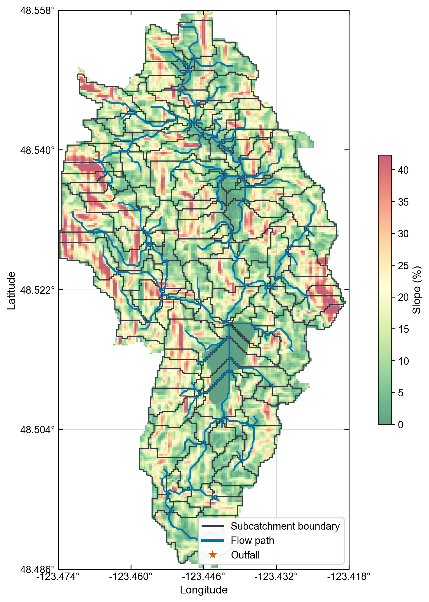

# QGIS Final Layers MCP Workflow

This update adds a clean delivery step for QGIS/GRASS watershed preprocessing. The audit tree remains available for reproducibility, but users no longer need to search through intermediate folders to find the GIS layers needed for SWMM modeling.

## Natural-language trigger

Example prompt:

```text
Tony, use QGIS/GRASS to process a new catchment with the standard watershed workflow.

Inputs:
- DEM: path/to/dem.tif
- Boundary: path/to/boundary.shp
- Land use: path/to/landuse.shp
- Soil: path/to/soil.shp

Use stream threshold 100. First check CRS. If all layers are already in the same projected CRS, do not normalize or clip the layers. Run the QGIS/GRASS watershed delineation, create a slope-percent raster from the DEM, and package the final outputs into final_layers with subcatchments.shp, flow.shp, slope_percent.tif, outfall.shp, overview.png, and manifest.json.
```

For Tod Creek-style runs, the short form is:

```text
Tony, run the Tod Creek raw data through QGIS/GRASS standard watershed delineation with threshold 100, do not normalize, and package final_layers.
```

## Final outputs

The MCP tool `qgis_package_final_layers` creates:

```text
runs/<case>/final_layers/
  subcatchments.shp
  flow.shp
  slope_percent.tif
  outfall.shp
  overview.png
  manifest.json
```

`manifest.json` records the source rasters/vectors and feature counts. The larger run folder still keeps audit artifacts such as QGIS command logs, CRS reports, threshold rasters, and memory cards.

## Area-weighted parameters

The MCP tool `qgis_area_weighted_params` intersects `final_layers/subcatchments.shp` with land-use and soil polygons, computes per-class area fractions, and maps those fractions through the bundled SWMM lookup tables. It writes:

```text
runs/<case>/02_params/area_weighted/
  weighted_params.json
  landuse_weighted_params.json
  soil_weighted_params.json
  landuse_area_weights.csv
  soil_area_weights.csv
```

Use `weighted_params.json` as the `swmm-builder` params input. The CSV files are audit artifacts showing the class fractions used for each subcatchment.

## Example result

The overview figure uses a semi-transparent slope background, green for low slope, red for high slope, bold subcatchment boundaries, prominent blue flow paths, an outfall marker, inward ticks, longitude/latitude border labels, a legend, and an Arial-first font stack.



## Modeling boundary

This workflow produces GIS layers for the next SWMM modeling stage. It does not by itself prove hydrologic calibration or simulation performance. After packaging these layers, continue through `swmm-builder`, rainfall/parameter preparation, `swmm-runner`, and experiment audit before making performance claims.
