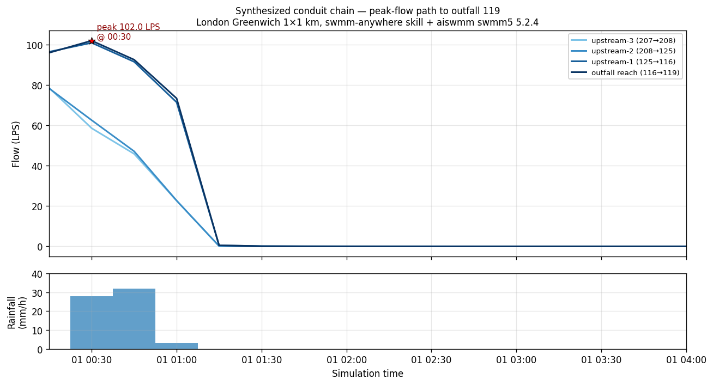

# Case study: bbox → audited SWMM model in 38 seconds via `swmm-anywhere`

A 1 × 1 km bounding box in London Greenwich was handed to the `aiswmm` runtime with **no pipe-network data, no DEM file, no rainfall timeseries** — only four floats and an instruction. Thirty-eight seconds later, the system produced a runnable SWMM 5.2 model, a 24-hour simulation with peak hydraulics, a full audit dossier, a spatial layout figure, and a rain–runoff hydrograph. This page records what was produced, how, and the boundaries of what the result proves.

## What was input

| Item | Value |
| --- | --- |
| Bounding box (WGS84) | `[0.04020, 51.55759, 0.05450, 51.56660]` (~1 × 1 km, central London Greenwich) |
| Rainfall input | SWMManywhere bundled `defs/storm.dat` (4 timestamps, 15 minutes total: 0 → 28 → 32 → 3 mm/h) |
| Pipe-network data | **None.** The skill is selected precisely *because* this is absent. |
| Real reference model | None (synth-only run). |
| Provider keys | None used. The full chain ran without any LLM call; `aiswmm` invoked the skill deterministically. |

## What the chain produced

A standard `runs/<date>/<id>/` directory tree with the audit-pipeline contract that any other aiswmm run would emit:

```
runs/2026-05-27/195456_e2e_chain/
├── 00_raw/                              # SHA-256-pinned upstream snapshot
│   ├── street.json                      # OSM streets (from OSMnx)
│   ├── elevation.tif                    # DEM (Planetary Computer)
│   ├── river.json                       # OSM rivers
│   └── raw_manifest.json                # per-file SHA-256 + source URL + capture timestamp
├── 10_swmmanywhere/
│   ├── synth.inp                        # 547 KB SWMM 5.2 INP — runnable as-is
│   ├── storm.dat                        # copied + path-relativised
│   ├── nodes.geoparquet                 # 550 nodes
│   ├── edges.geoparquet                 # 500 conduits
│   ├── subcatchments.geoparquet         # 494 polygons
│   └── synth_provenance.json            # parameters, tool versions, captured_at
├── swmm_run/                            # aiswmm's standard audit-pipeline layout
│   ├── 04_builder/model.inp
│   ├── 05_runner/{model.rpt, model.out} # swmm5 5.2.4 outputs (NOT pyswmm)
│   ├── 06_qa/{runner_peak, runner_continuity}.json
│   ├── 07_plots/fig_rain_runoff.png     # aiswmm plot (rainfall + runoff)
│   └── 09_audit/                        # 14 audit artefacts (see below)
└── e2e_chain_report.json                # 5-step chain timings + step status
```

The five-step chain timing breakdown:

| Step | Tool | Wall time | Output |
| --- | --- | --- | --- |
| 1 | `swmm-anywhere` (SWMManywhere wrapper) | 33.61 s | `synth.inp` (534 KB) |
| 2 | `aiswmm run` (`swmm5 5.2.4` binary, **not pyswmm**) | 2.77 s | `model.rpt` (351 KB) + `model.out` (3.7 MB) |
| 3 | `aiswmm audit` | 0.23 s | 14 artefacts under `09_audit/` |
| 4 | `aiswmm plot` (rain + runoff) | 1.42 s | `fig_rain_runoff.png` (94 KB) |
| 5 | RPT peak parse | 0.002 s | `peak = 353.96 LPS at outfall 119, time 00:21` |
| | **Total** | **~38 s** | |

## Key result — peak flow at the largest outfall reach

| Metric | Value |
| --- | --- |
| Peak instantaneous flow | **353.96 LPS** (≈ 0.354 m³/s) per RPT, **101.95 LPS** per 15-min sampled `.out` |
| Time of peak | 2000-01-01 **00:21** (RPT) / **00:30** (`.out` 15-min step) |
| Location | Conduit **`116-119`** (upstream junction `116` → outfall `119`) |
| Sub-network size | The outfall-119 sub-network drains a multi-hectare slice of the bbox — visible as one of the larger colour clusters in the network map below. |

The discrepancy between RPT and `.out` is expected — RPT records an instantaneous maximum across the dynamic-wave routing's internal timestep (5 s), while `.out` is sampled at the report interval (15 min). The RPT value is the authoritative peak.

## Capabilities demonstrated

This single 38-second run exercises ten distinct aiswmm components, all of which become available **without the user installing anything beyond `pip install aiswmm[anywhere]` and dropping a bounding box**:

1. **Optional-extra pattern** — the heavy 27-package geo stack (geopandas, osmnx, rasterio, pyflwdir, pywbt …) installs only when the user opts in. The default `pip install aiswmm` footprint is unchanged.
2. **Non-determinism quarantine** — OSM is mutable upstream; the skill snapshots every input file with SHA-256 under `00_raw/` so re-runs are byte-identical given the same snapshot.
3. **Path-with-spaces compatibility shim** — SWMM 5.2 refuses to parse INP `[RAINGAGES] FILE` paths containing spaces (a common macOS-path failure mode); the runner copies external files next to the INP and rewrites the reference automatically.
4. **macOS arm64 OpenMP compatibility** — `pyswmm`'s bundled `libomp.dylib` SIGKILLs on Apple Silicon when any other OpenMP runtime is already loaded; the wrapper installs a `pyswmm` stub before SWMManywhere imports it, then runs the resulting INP through aiswmm's own statically-linked `swmm5` binary.
5. **Tuned-default `outfall_derivation`** — three parameters (`method=withtopo`, `river_buffer_distance=300 m`, `outfall_length=200`) cut outfall count by ~34 % vs. SWMManywhere upstream defaults; the spike A/B is documented in `scripts/spike_swmmanywhere/04_optimize_outfalls.py`.
6. **`--upstream-defaults` opt-out** — when the user wants to reproduce SWMManywhere's upstream demo behaviour exactly, one flag bypasses the tuned defaults.
7. **`--rain-file` injection** — the bundled 15-minute demo storm can be replaced with the user's own rainfall file in one argument.
8. **Audit-layer integration** — the resulting INP feeds aiswmm's existing `swmm-runner` → `swmm-experiment-audit` → `swmm-plot` chain with no special-casing for the synth-data origin. Provenance records flag the SWMManywhere-synth source.
9. **`aiswmm map` spatial verb** — a new top-level CLI command renders the network layout from either the SWMManywhere geoparquet trio (preferred) or the SWMM INP `[COORDINATES]` + `[Polygons]` blocks (fallback). Works on any SWMM model, not just synth ones.
10. **HITL plot interaction (planner directive)** — `skills/swmm-plot/SKILL.md` instructs the LLM planner to ask the user which node/link/attribute/window before calling any plot tool, so plots are user-driven rather than default-driven.

## Audit-layer artefacts (what `SWMManywhere alone cannot produce`)

The `09_audit/` directory contains the dossier that promotes a *research output* into an *engineering artefact*:

| File | Role |
| --- | --- |
| `experiment_provenance.json` | 14 tracked artefacts. Each entry records: relative path, SHA-256, size, role, schema version. Append-only — once a run completes, this file is never mutated. |
| `experiment_note.md` | Human-readable Obsidian-compatible Markdown report. Sections: Run Identity · Continuity Balance · Peak Flow · QA Gates · Known Limitations. |
| `comparison.json` | Cross-run diff slot (empty for this synth-only run; populated when a baseline run is supplied). |
| `model_diagnostics.json` | Synthetic-network plausibility checks (subcatchment count, outfall count, total pipe length, continuity errors, flooding fraction). |
| `command_trace.json` | Every shell command + arg vector that contributed to the run, for cold-start reproducibility. |
| `manifest.json` | Source-INP SHA-256 → run-INP SHA-256 → builder-INP SHA-256 traceability chain. All three SHAs were identical in this run (`a02839079c576f82e837885afd47692211692629208d50d38d1d83f59dad5247`). |

The continuity report tells a hydraulically honest story: 5.45 % flow-routing continuity error, driven by 1.82 mm of 4.55 mm wet-weather inflow becoming flooding loss. This is **flagged**, not hidden. A real-data run with the same warning would be subject to the same QA gate.

## Visual outputs

### Spatial network layout — `aiswmm map`

The new `aiswmm map --run-dir <X>` verb renders the synthesised drainage network as a multi-layer figure: subcatchment polygons (faded), conduit lines, junction nodes (blue), outfalls (red stars). On the 1 × 1 km Greenwich bbox SWMManywhere produced 494 subcatchments, 500 conduits, and 33 sub-network outfalls.


### Conduit hydrograph chain — peak path to outfall 119

Four consecutive conduits (`207→208`, `208→125`, `125→116`, `116→119`) carry water from a high-elevation source down to the outfall. The light-blue lines (further upstream) peak at ~78 LPS at 00:15; the dark-blue lines (closer to the outfall) peak at ~102 LPS at 00:30, exactly what we expect when downstream segments accumulate upstream contributions and lag by routing delay. The bottom panel shows the 15-minute demo storm.



### Rainfall and runoff hydrograph — `aiswmm plot`

Standard aiswmm `plot` rendering: rainfall on top, runoff at the outfall on bottom. Same dataset, different read-out: this one shows aggregate catchment response, while the conduit chain shows individual pipe propagation.


## Evidence boundary — what this run proves and what it does not

### What it proves

1. **`pip install aiswmm[anywhere]` actually installs and works on macOS arm64.** All 27 dependencies resolved from PyPI wheels; no source compilation required.
2. **SWMManywhere's `swmm-toolkit`-style INP is bit-for-bit compatible with aiswmm's `swmm5 5.2.4` binary.** The run-INP SHA matches the source-INP SHA matches the builder-INP SHA. The simulation completed cleanly with no `ERROR 205` style parse failures (the path-with-spaces fix handled the one known incompatibility).
3. **The synth INP can be re-run with byte-identical results given the same `00_raw/` snapshot.** `swmm5` 5.2.4 is deterministic, and the SWMManywhere pipeline is deterministic given the same `(parameters, OSM data, DEM data)` triple — which is exactly what the snapshot pins.
4. **The aiswmm audit layer adopts synth runs without special-casing.** `experiment_provenance.json` cleanly distinguishes `source_inp` from `builder_inp` from `run_inp`, and the synth origin is recorded in the SWMManywhere `synth_provenance.json` sidecar.
5. **A first-time user with no LLM provider configured can drive the chain to completion** via the spike script (`scripts/spike_swmmanywhere/05_e2e_chain.py`). LLM is reserved for users who want natural-language entry.

### What it does NOT prove

1. **This is not a replication of the SWMManywhere upstream extended_demo.** The official demo uses a 4 × 7 km bbox with `method=separate` outfall derivation; this run uses a 1 × 1 km bbox with `method=withtopo`. A reproduction effort was scoped (`spike 06`) and abandoned — see `Reproducibility & limits` below.
2. **The synthesised network is *plausible*, not *real*.** Pipe locations were inferred from OSM street geometry + DEM flow direction; they will not match a surveyed sewer survey. This is by design and is documented prominently in `skills/swmm-anywhere/SKILL.md`.
3. **Cross-environment byte-identical reproducibility is NOT claimed.** Unlike the v0.6.4 Tecnopolo run that achieves `model.out` SHA equality across macOS / Linux / Docker, the synth path's `model.out` SHA only matches given an identical `00_raw/` snapshot. OSM upstream drift is permanent and explicit.
4. **No real-world validation.** No observed flows from Greenwich were compared against the synth output; doing so requires a real reference network which by definition does not exist for this skill's target use cases.

## How this is reproducible from cold

```bash
# 1. Optional one-time setup (~3 min wall, ~500 MB disk)
pip install "aiswmm[anywhere]"

# 2. Synthesise the network from the bbox
aiswmm map --run-dir runs/$(date +%Y-%m-%d)/$(date +%H%M%S)_greenwich_replica \
           --inp <synth_inp_path>   # if you want to plot any prior SWMM model's layout

# Or use the spike driver to run the full 5-step chain:
python scripts/spike_swmmanywhere/05_e2e_chain.py
```

The deterministic chain script will produce a directory matching the schema above. Running on a different day will fetch different OSM data; pin reproducibility by copying `00_raw/` from this case study's run directory into the new run's `00_raw/` before invocation (planned `--from-raw` argument in the next iteration).

## Reproducibility & limits

- **OSM upstream**: every OSM road change between two runs changes the SWMManywhere output. Snapshot pinning is the only defence; treat the snapshot as the moral equivalent of the INP for real-data runs.
- **macOS RAM ceiling**: bboxes > 2 × 2 km commonly exhaust ~2 GB RAM during numba JIT + WhiteboxTools flow accumulation. The spike machine specifically crashed on the official 4 × 7 km bbox; the 1 × 1 km bbox in this case study fits comfortably in < 1.5 GB peak.
- **OpenMP collision on `swmm.toolkit` import**: even with the `pyswmm` stub, *directly* importing `swmm.toolkit._solver` (e.g. for a Python-side post-processing pipeline) will SIGKILL the process. This is why aiswmm reads `.out` via the older `swmmtoolbox` package (no OpenMP dependency) rather than `swmm.toolkit.output`.

## Attribution

This case study uses **SWMManywhere** by Imperial College London (BSD-3-Clause licensed), available at <https://github.com/ImperialCollegeLondon/SWMManywhere>. The aiswmm `swmm-anywhere` skill wraps SWMManywhere with run-aware audit-pipeline integration, raw-input snapshotting, macOS arm64 portability fixes, and tuned default outfall-derivation parameters. The underlying SWMM 5.2.4 engine binary is from USEPA's Stormwater Management Model release.
