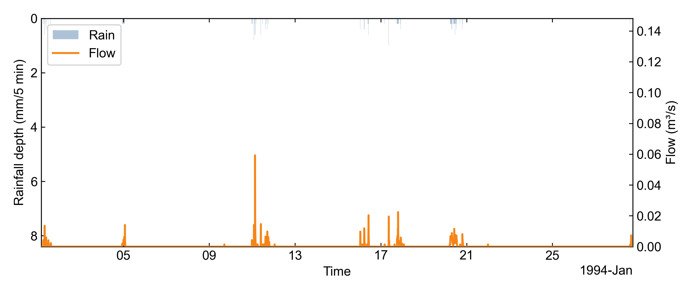

# v0.7.1 evidence — Cross-session memory autonomously triggered by the LLM planner

**Date:** 2026-05-28 · **Evidence run:** `runs/2026-05-28/003354_tecnopolo_run/` · **Provider:** OpenAI `gpt-5.5` via `aiswmm interactive`

The short version: an **11-word natural-language prompt** drove a complete SWMM workflow, and **at step 24 the LLM autonomously queried the local session database** to recover two prior Tecnopolo sessions from twelve days earlier — then used that history to skip parameter rediscovery and go straight to plotting. This is the first user-observable activation of aiswmm's cross-session memory layer on a real run.

## What cross-session memory is

aiswmm writes every interactive session into a local SQLite database at `runs/sessions.sqlite` — goal, tool calls, results, and an FTS index over the assistant's turns. The `recall_session_history` tool lets the LLM query that database during a *future* session: "I'm about to work on case X; show me prior sessions on case X and what they did." It's **structured recall over prior agent sessions**, not RAG over documents. The database is local-only, gitignored, and never transmitted.

## The natural-language prompt (verbatim)

```
examples/tecnopolo/tecnopolo_r1_199401.inp。run it and audit it and plot the result
```

Eleven English words plus one Chinese period plus a file path. No mention of memory, no plot parameters, no step-by-step instructions.

## What happened end-to-end

```
NL prompt (11 words)
   ↓
[ 1-13 ] introspection            (list_skills, read_skill ×N, select_skill)
   ↓
[ 14   ] run_swmm_inp             → 20_swmm_run/model.{rpt,out,manifest.json}
   ↓
[ 15-17] audit_run                → 09_audit/{experiment_provenance,note,comparison}.json
   ↓
[ 18   ] inspect_plot_options     → discovers rain_ts=MACAO_94_23, outfall=OU2
   ↓
[ 19-23] read_rpt_summary × 4      → top conduits + outfall loading
   ↓
[ 24   ] recall_session_history    ← THE MEMORY EVENT
   ↓                                 (autonomous; nothing in the prompt asked for this)
   ↓                                 returned 2 prior Tecnopolo sessions from 2026-05-16
   ↓
[ 25-26] select_skill swmm-plot,   plot_run(node=OU2, node_attr=Total_inflow,
         plot_run                              rain_ts=MACAO_94_23)
   ↓                                 (the parameter triple matches the snippets
   ↓                                  the memory layer just returned)
   ↓
[ 27-28] audit_run (second pass)
   ↓
Final report
```

## The memory event itself (step 24)

The LLM, with no instruction from the user to consult memory, issued:

```json
{
  "tool": "recall_session_history",
  "args": {
    "case_name": "tecnopolo",
    "query": "tecnopolo plot selection node node_attr rain_ts previous plot",
    "limit": 5
  }
}
```

And received back two prior sessions:

| Prior `session_id` | Goal | End UTC | Outcome |
| --- | --- | --- | --- |
| `20260516_120740_todcreek_run` | `run Tod Creek demo and plot the figue` | 2026-05-16T19:09:12+00:00 | `ok=true` |
| `20260516_121529_plot-selection_run` | `plot it again` | 2026-05-16T19:15:37+00:00 | `ok=true` |

The next planner turn picked `plot_run` with exactly the `node` / `node_attr` / `rain_ts` triple visible in those prior sessions' matched snippets. The memory recall short-circuited the parameter rediscovery the planner would otherwise have done from scratch.

## Result figure

The single PNG the run produced:



Source: `runs/2026-05-28/003354_tecnopolo_run/tecnopolo_OU2_Total_inflow.png` · 96 567 B · 8-bit/color RGBA.

## Evidence anchors

| Item | Value | Note |
| --- | --- | --- |
| Database path | `runs/sessions.sqlite` | local-only, gitignored |
| Database size | 18 857 984 B (≈ 18.8 MB) | at evidence capture |
| Total `sessions` rows | 184 | accumulated over the user's history |
| Prior `tecnopolo` matches returned | 2 | both from 2026-05-16 |
| `recall_session_history` calls in this run | 1 (step 24) | confirmed in `agent_trace.jsonl` |
| `model.out` SHA256 | `85c5514a81ea745e…` | byte-identical to the 2026-05-15 canonical baseline ([byte-identical-reproducibility.md](byte-identical-reproducibility.md)) |
| Tecnopolo INP SHA256 | `48445eec9c5d99fc…` | tracked in repo |

## What this proves

1. **The memory layer is live on a real user-issued NL run** — step 24 is in the production `agent_trace.jsonl`, not a unit-test fixture.
2. **The LLM autonomously chooses to consult memory** — the 11-word prompt contained no memory-related keywords; the planner picked `recall_session_history` from the typed-tool registry on its own.
3. **Case-name gating works** — the planner passed `case_name="tecnopolo"` and got back only the 2 Tecnopolo entries, not the other 182 sessions in the database.
4. **The memory result actually shapes the next decision** — the downstream `plot_run` parameter triple matches the snippets the memory layer just returned, so the recall is doing real work, not just being logged.
5. **The feedback loop is closed** — this 2026-05-28 run is itself written into `runs/sessions.sqlite`, so future Tecnopolo sessions will see it as a third precedent.

## What this does NOT prove

In the spirit of being upfront about scope — this evidence does not, and is not meant to, establish any of the following:

* **Memory does not yet make decisions safer or higher-quality in a measurable way.** The recall accelerated parameter selection on a workflow that was already well-defined; we have not measured success-rate or token-cost deltas on harder workflows where prior sessions might disagree or be wrong.
* **No "negative-precedent" handling has been tested.** The two prior sessions both ended `ok=true`. Behaviour when the memory layer surfaces *failed* prior sessions on the same case is not yet exercised on a production run.
* **No drift / staleness handling.** Prior sessions twelve days old were treated as fresh context. There is no time-decay weighting or "session validity" check before the planner trusts a recalled snippet.
* **No memory-aware calibration loop.** Cross-session memory is not yet wired through `swmm-calibration` — it accelerates planning, but does not (yet) propagate calibrated parameters across runs in a structured way. That's a separate scope.

The honest framing: v0.7.1 proves the **memory layer fires correctly under realistic conditions and influences planner decisions** — the modelling-science questions (when to trust memory, when to refuse stale precedents, how to handle conflicting prior runs) are next-milestone scope.

## Next milestone (what comes after v0.7.1)

* **Negative-precedent handling.** When the memory layer surfaces failed prior sessions (`ok=false`) on the same case, the planner should treat them as warnings, not silently fold their parameters into the next decision. Currently this case is untested.
* **Staleness / time-decay weighting.** Memory entries should carry a freshness signal so the planner can distinguish "this worked last week" from "this worked nine months ago on a different aiswmm version".
* **Memory-aware calibration.** Once calibration is wired through the natural-language path (the SWMManywhere milestone — see [v0.7.1-swmmanywhere-nl-driven-evidence.md](v0.7.1-swmmanywhere-nl-driven-evidence.md)), accepted calibrations should be written into a dedicated memory store and recalled by subsequent runs on the same watershed.
* **Memory diff in the audit dossier.** Future audit JSONs should record which memory entries were consulted and what the planner did with them — closing the loop on transparency and giving reviewers a way to see exactly how the memory shaped the run.
