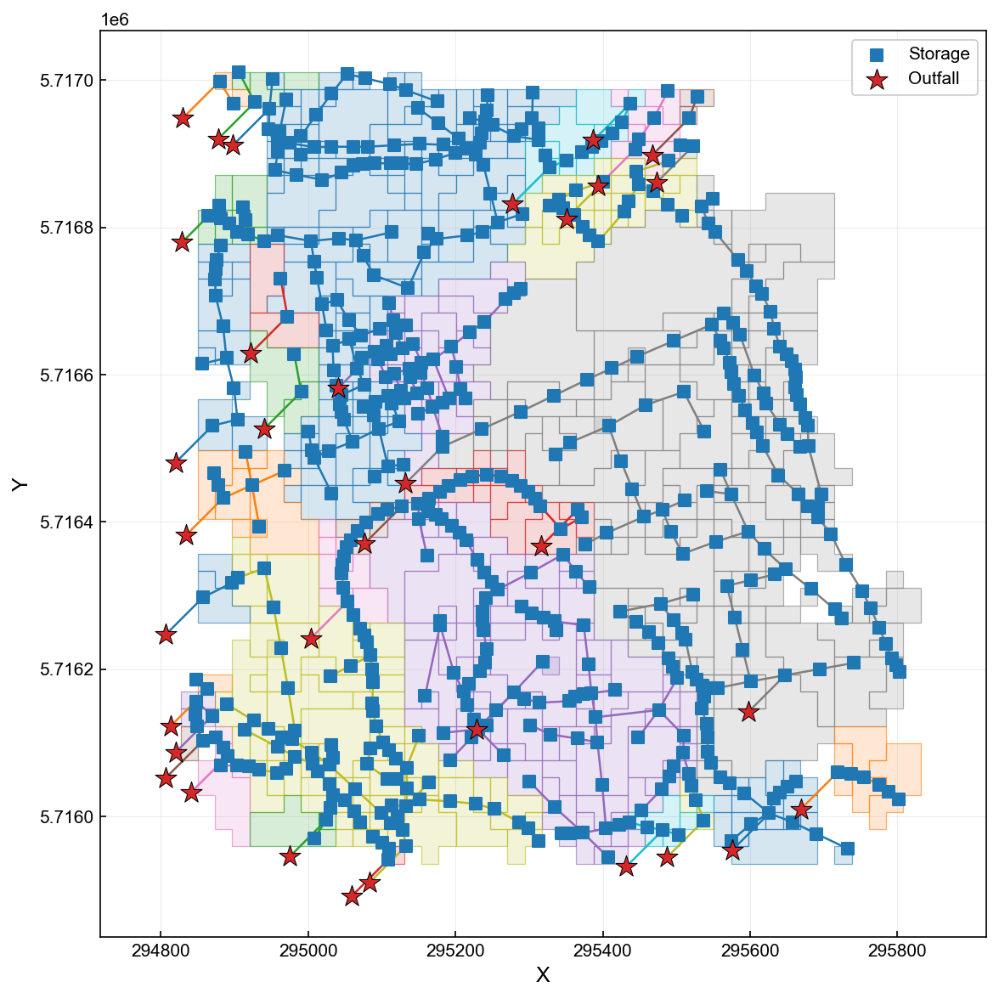
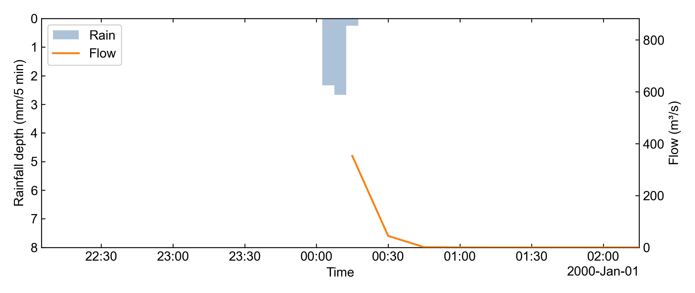
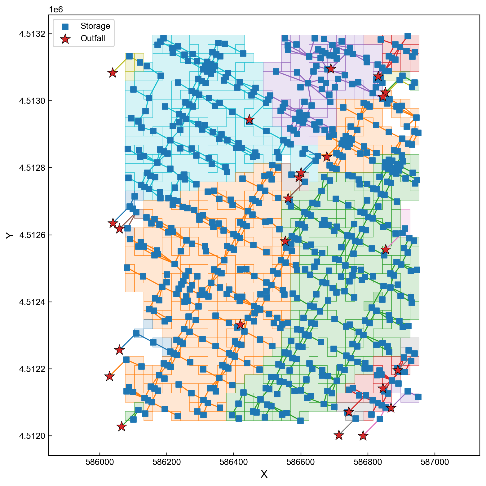

# v0.7.1 evidence — Natural-language-driven SWMManywhere integration

**Date:** 2026-05-27 · **Provider:** OpenAI `gpt-5.5` via `aiswmm interactive`

This is the short evidence sheet for the SWMManywhere integration shipped in v0.7.1. The headline is simple: **a single natural-language sentence, referring only to a WGS84 bounding box, drives an end-to-end SWMM workflow — synthesise → run → audit → render — and lands the artifacts in the standard aiswmm run-directory layout.** The synthesis itself is upstream's work; aiswmm is the agent-side adapter.

## Credit where it's due

The hard part — figuring out where pipes plausibly go when all you have is a bounding box, OSM streets, and a DEM — comes from **[SWMManywhere](https://github.com/ImperialCollegeLondon/SWMManywhere)**, the Imperial College London project (BSD-3-Clause). Every pipe in the figures below is their algorithm at work. aiswmm contributes the layer above: a typed LLM tool, a SKILL.md contract, and a Python runner that handles a few macOS arm64 quirks. If you publish work that builds on what's here, the citation target is **SWMManywhere** — please check their upstream repo for guidance.

## The natural-language prompts (verbatim)

Two runs captured on disk, both with the same prompt shape — just swap the bounding box:

**Greenwich Peninsula (1 × 1 km, central London):**
```
Using SWMManywhere, synthesise a SWMM model from the WGS84 bounding box
0.04020,51.55759,0.05450,51.56660 (London Greenwich Peninsula, ~1 km²).
Then run SWMM on the synthesised .inp. Audit the run directory for
deterministic provenance. Render the spatial network layout map as a PNG.
```

**NYC Midtown (1 × 1 km):**
```
Using SWMManywhere, synthesise a SWMM .inp file from the WGS84 bounding
box -73.98,40.755,-73.97,40.765 (NYC midtown, ~1 km²). Then run SWMM
on the synthesised .inp and tell me the peak outfall flow. Audit the
run directory for deterministic provenance. Finally render the spatial
network layout map as a PNG.
```

No shapefile path, no DEM file, no step-by-step tool instructions. The LLM agent reads the SKILL.md contracts and the typed-tool registry, and picks `synth_swmm_from_bbox` → `run_swmm_inp` → `audit_run` → `map_run` on its own.

## What you get end-to-end

```
NL prompt (1 sentence)
   ↓
synth_swmm_from_bbox   →  10_swmmanywhere/synth.inp         (SWMM 5.2 INP)
   ↓                       10_swmmanywhere/*.geoparquet     (network geometry)
   ↓                       00_raw/raw_manifest.json         (OSM/DEM hash + cache)
   ↓
run_swmm_inp           →  20_swmm_run/model.rpt             (SWMM rpt)
   ↓                       20_swmm_run/model.out             (binary timeseries)
   ↓                       20_swmm_run/manifest.json         (peak + continuity)
   ↓
audit_run              →  09_audit/experiment_provenance.json
   ↓                       09_audit/experiment_note.md
   ↓                       09_audit/model_diagnostics.json
   ↓                       09_audit/comparison.json
   ↓
map_run                →  network_layout.png                 (network figure)
   ↓
final_report.md       (NL summary + artifact list)
```

Total wall-clock on a 1 × 1 km bbox: **≈ 38 s** on macOS arm64 (first run; subsequent runs of the same bbox hit the `00_raw/` cache and finish faster).

## Result figures

### Greenwich Peninsula — synthesised network (494 subcatchments, 500 conduits, 33 outfalls)



### Greenwich Peninsula — rainfall vs outfall hydrograph



### NYC Midtown — `map_run` output from the 2026-05-27 verification run



## Evidence anchors

| Artifact | SHA256 / size | Source |
| --- | --- | --- |
| `examples/tecnopolo/tecnopolo_r1_199401.inp` (the byte-identical lock-in this run is layered on) | `48445eec9c5d99fc…` | tracked |
| NYC Midtown `synth.inp` | `8f977a02d8b866c2…` (644 222 B) | this run |
| NYC Midtown `model.out` | `dc3253e443c15895…` (4 634 861 B) | this run |
| NYC Midtown `network_layout.png` | 328 610 B, 1568 × 1568 px | this run |
| Greenwich `network_map.png` | 198 946 B | committed evidence |
| Greenwich `rain_runoff.png` | 96 532 B | committed evidence |

## What this proves

1. A single natural-language sentence referring to a bounding box is sufficient to drive the **complete end-to-end workflow**: synthesis, simulation, deterministic audit, and network map rendering — all four artifacts land in the standard `runs/<date>/<id>/` layout.
2. The LLM agent picks the right tool from the typed registry without any hardcoded routing rules — `synth_swmm_from_bbox`, `run_swmm_inp`, `audit_run`, `map_run` are chosen by reading SKILL.md and the tool schemas.
3. The same prompt shape works across at least two independent regions (Greenwich, NYC) — the chain is not bbox-specific.
4. The deterministic SWMM execution path is unchanged from v0.7.0: a separately tracked Tecnopolo regression (see [byte-identical-reproducibility.md](byte-identical-reproducibility.md)) produces a byte-identical `model.out` SHA256 on v0.7.1, so the new typed-tool layer does not perturb SWMM numerics.

## What this does NOT prove

In the spirit of being upfront about scope — this evidence does not, and is not meant to, establish any of the following:

* **The synthesised network is not calibrated against observed flows.** No measured hydrograph at any node was compared with the simulated output. The synthesis is a plausible inferred network from public OSM + DEM data, not a surveyed pipe layout.
* **The model is not validated.** No held-out storm, no split-sample test, no peer-reviewed comparison against a reference solution.
* **Continuity behaviour of synthesised networks is not characterised yet.** Synthesised networks can exhibit elevated routing continuity error (typical SWMManywhere outputs sit above the 1 % engineering best-practice threshold for some bboxes) — characterising and reporting this systematically is part of the next milestone.
* **A calibration loop has not been wired into the agent path yet.** The skill-side `swmm-calibration` MCP server exists, but the natural-language driver does not currently chain `synth_swmm_from_bbox → calibrate` end-to-end. This is the next development target after v0.7.1.

The honest framing: v0.7.1 proves the **agent-side plumbing for SWMManywhere is reliable end-to-end** — the modelling-science quality bars (calibration, validation, uncertainty) are the next-milestone scope and explicitly out of scope here.

## Install

`pip install aiswmm[anywhere]` pulls **SWMManywhere** (Imperial College London, BSD-3-Clause) from PyPI — that's where the synthesis algorithm lives. aiswmm doesn't vendor or modify it. It's worth a look at <https://github.com/ImperialCollegeLondon/SWMManywhere> for the upstream docs, the license, and their citation guidance.

```bash
pip install "aiswmm[anywhere]"
aiswmm interactive
# Then paste either prompt from "The natural-language prompts" section above.
```

## Next milestone (what comes after v0.7.1)

* Wire the natural-language driver through `swmm-calibration` so a single prompt can take the synthesised network and tune it against an observed hydrograph.
* Characterise routing continuity behaviour across a sweep of bbox sizes / regions, and surface it in the audit dossier as a first-class metric.
* Add an evidence-boundary check to `final_report.md` so any synthesised run is automatically flagged as "uncalibrated baseline" until a calibration round writes a calibration-evidence file alongside the audit JSONs.
