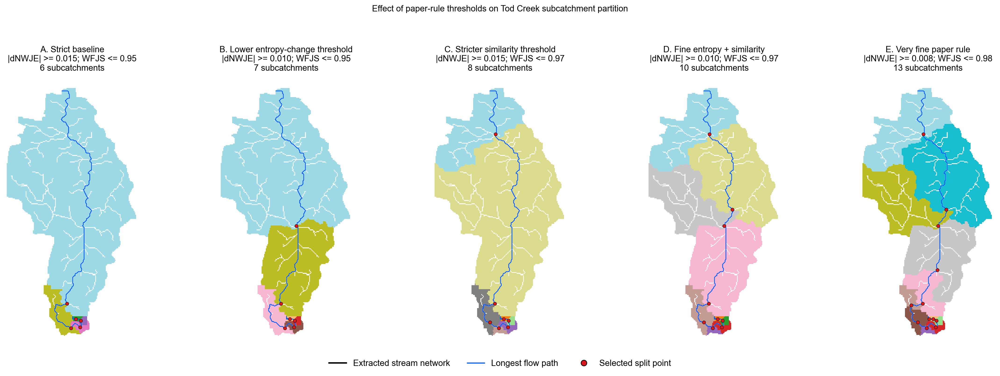
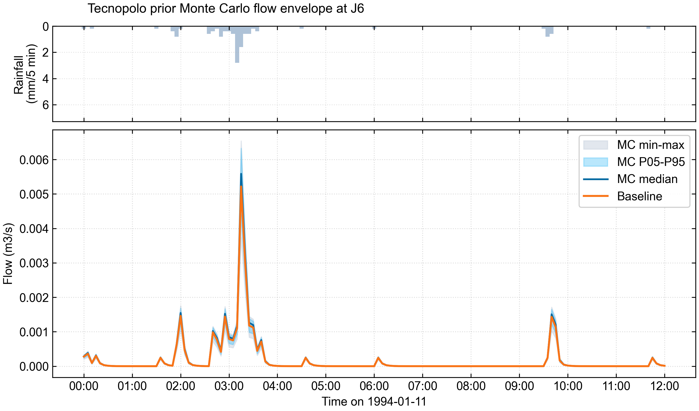

# Validation Evidence

This document keeps the detailed benchmark and verification notes out of the README while preserving the evidence boundary for reviewers and collaborators.

## Benchmark paths

Agentic SWMM includes benchmark paths that test different parts of the workflow, plus additional acceptance and fallback checks.

## Information-loss-guided subcatchment partition

The information-loss-guided subcatchment partition validates the GIS preprocessing concept that maps an entropy- and fuzzy-similarity-based decision rule onto SWMM-ready subcatchment polygons. It is the structured-raw upstream of the GeoPackage-to-INP path: starting from DEM, boundary, land-use, and soil rasters, it picks the partition variant that minimises information loss relative to the underlying paper rule from Zhang & Valeo's [Journal of Hydrology paper](https://doi.org/10.1016/j.jhydrol.2025.134447).

<p align="center">
  
</p>

Run (Tod Creek case wrapper):

```bash
python3 scripts/qgis_todcreek_raw_to_entropy_partition.py
```

Or cross-watershed (point at any compliant raw GIS layer set):

```bash
python3 skills/swmm-gis/scripts/qgis_raw_to_entropy_partition.py \
  --boundary <boundary.shp> \
  --dem <dem.tif> \
  --landuse <landuse.tif> \
  --soil <soil.tif> \
  --out-root runs/<case>/02_params/paper_entropy_partition/
```

This is a **GIS preprocessing concept**, not a calibrated SWMM performance claim. The evidence boundary is partition quality (information-loss minimisation) rather than hydrologic accuracy of any one realised SWMM build. See `skills/swmm-gis/SKILL.md` for the full decision rule and threshold-sensitivity sweeps.

## Raw GeoPackage-to-INP benchmark

The TUFLOW SWMM Module 03 benchmark validates the structured raw GIS path. This is the stronger agentic workflow demonstration because it starts from public GeoPackage model layers and rebuilds the SWMM-ready structure before running QA and audit.

It converts public GeoPackage layers into SWMM-ready artifacts, including junctions, outfalls, conduits, subcatchments, raingages, multi-raingage rainfall inputs, `network.json`, `subcatchments.csv`, parameter JSON, a generated `model.inp`, SWMM outputs, QA summaries, and audit notes.

<p align="center">
  
</p>

Run:

```bash
python3 scripts/benchmarks/run_tuflow_swmm_module03_raw_path.py
```

See `../examples/tuflow-swmm-module03/README.md` for download instructions, expected artifacts, metrics, and the raw GeoPackage evidence boundary.

## Prepared-input SWMM benchmark

The Tecnopolo benchmark validates the prepared-input path using an external 40-subcatchment SWMM model derived from a public Zenodo dataset.

It checks that the workflow can execute an external SWMM model, compare workflow outputs against direct `swmm5` execution, inspect both an outfall and an internal junction, generate rainfall-runoff figures, and emit audit-ready artifacts.

<p align="center">
  
</p>

<p align="center">
  
</p>

Run:

```bash
python3 scripts/benchmarks/run_tecnopolo_199401.py
```

See `../examples/tecnopolo/README.md` for validation details, expected peak-flow checks, reproducibility notes, and the prepared-input evidence boundary.

## Prior Monte Carlo uncertainty smoke

The Tecnopolo HORTON parameter perturbation smoke test exercises the prior uncertainty path on top of a prepared-input SWMM model. It identifies perturbable parameters in the Tecnopolo HORTON INP, applies a small Monte Carlo sample, runs SWMM for each trial, and emits a peak-flow spread per junction/outfall plus a rainfall-plus-flow envelope figure for the requested node.

<p align="center">
  
</p>

Run:

```bash
python3 scripts/benchmarks/run_tecnopolo_mc_uncertainty_smoke.py \
  --samples 20 \
  --seed 42 \
  --node OUT_0 \
  --scan-nodes \
  --entropy-nodes J6 OUT_0
```

Outputs land under `runs/benchmarks/tecnopolo-mc-uncertainty-smoke/`: `summary.json`, `parameter_recommendations.json`, per-trial folders, the envelope figure, and J6/OUT_0 entropy JSON files plus an entropy curve.

This is a **prior uncertainty smoke**, not calibration. The evidence boundary is that the framework can wire perturbed prior parameters end-to-end through SWMM and aggregate the spread; it does not condition on observed flow, so the resulting envelope is informative only as a prior diagnostic. See `skills/swmm-uncertainty/SKILL.md` for the underlying parameter scan and entropy-metric tooling.

## INP-derived raw adapter benchmark

The `generate_swmm_inp` adapter benchmark is an optional reproducibility check for the modular Agentic SWMM path. It fetches a fixed public upstream commit from `Jannik-Schilling/generate_swmm_inp`, reads the open `Test_5_2.inp` fixture, extracts raw-like GeoJSON, CSV, and JSON inputs, then rebuilds and runs the case through the repository's network, GIS, parameter, builder, runner, and QA modules.

Run:

```bash
python3 scripts/benchmarks/run_generate_swmm_inp_raw_path.py
```

Evidence boundary: this is not a greenfield watershed case from DEM, land-use, soil, and drainage-asset source files. Its source is an existing public SWMM `.inp`; the benchmark is useful for testing raw-like adapter handoff and modular reconstruction, not for claiming independent watershed delineation or hydrologic validation.

## Structured city pipe-network adapter benchmark

The city dual-system network benchmark validates a more practical urban asset path for reducing manual pipe-network configuration. It starts from structured pipe/outfall CSV exports, infers missing junctions from pipe endpoint coordinates, preserves `minor_pipe` and `major_surface` layer metadata in `network.json`, runs network QA, builds a SWMM input file, and runs SWMM when `swmm5` is available.

Run:

```bash
python3 scripts/benchmarks/run_city_dual_system_network.py
```

Evidence boundary: this is a structured CAD/GIS asset-export adapter benchmark, not arbitrary CAD drawing recognition. The current dual-system support is representation and QA metadata for minor-pipe and major-surface layers exported as SWMM one-dimensional conduit sections, not fully coupled 1D/2D dual-drainage hydraulics.

## LID placement and entropy-guided LID smoke paths

The LID benchmark path starts from the prepared Tecnopolo SWMM model and generates bioretention scenarios by inserting `[LID_CONTROLS]` and `[LID_USAGE]` sections. It is useful for validating scenario generation, SWMM execution, objective scoring, and audit handoff.

The entropy-guided variant adds a priority table before scenario generation. The current priority-table workflow translates D8 / normalized joint entropy / fuzzy similarity style diagnostics into a subcatchment-level `lid_priority_score`, then uses `rank_by: "entropy_priority"` to choose candidate LID locations.

Run the standard LID smoke:

```bash
python3 scripts/benchmarks/run_tecnopolo_lid_placement_smoke.py --node OUT_0
python3 skills/swmm-experiment-audit/scripts/audit_run.py --run-dir runs/benchmarks/tecnopolo-lid-placement-smoke --no-obsidian
```

Run the entropy-guided LID smoke:

```bash
python3 scripts/benchmarks/run_tecnopolo_lid_placement_smoke.py \
  --config skills/swmm-lid-optimization/examples/tecnopolo_entropy_bioretention_config.json \
  --run-dir runs/benchmarks/tecnopolo-entropy-lid-placement-smoke \
  --node OUT_0

python3 skills/swmm-experiment-audit/scripts/audit_run.py \
  --run-dir runs/benchmarks/tecnopolo-entropy-lid-placement-smoke \
  --no-obsidian
```

Evidence boundary: these are design-exploration smoke tests, not final optimized LID plans. SWMM represents LID at the subcatchment scale, so these runs test which subcatchments receive LID controls, not exact intra-subcatchment placement. Fair placement-strategy comparisons should fix total LID area or budget and report unit-area or cost-normalized performance alongside total peak-flow and volume reductions.

## Additional runnable paths

The repository also includes an acceptance pipeline for regression checks and a minimal Tod Creek real-data fallback path for environments where the Tod Creek example inputs are available.

```bash
python3 scripts/acceptance/run_acceptance.py --run-id latest
python3 scripts/real_cases/run_todcreek_minimal.py
```

## Experiment audit example

The audit layer consolidates artifacts, QA checks, and metric provenance into an Obsidian-compatible experiment note. This example catches a recorded peak-flow value that does not match the value re-parsed from the SWMM report source section.

<p align="center">
  
</p>

For agent-orchestrated runs, inspect the generated audit note before treating outputs as research evidence.

## Optional local verification

Run acceptance:

```bash
python3 scripts/acceptance/run_acceptance.py --run-id latest
```

Check the acceptance report:

```text
runs/acceptance/latest/acceptance_report.md
```

Audit the run:

```bash
python3 skills/swmm-experiment-audit/scripts/audit_run.py --run-dir runs/acceptance/latest
```

Add `--obsidian-dir <vault-folder>` to write a copy of the same note into Obsidian.

Make a rainfall-runoff plot from acceptance outputs:

```bash
mkdir -p runs/acceptance/latest/07_plot
python3 skills/swmm-plot/scripts/plot_rain_runoff_si.py \
  --inp runs/acceptance/latest/04_builder/model.inp \
  --out runs/acceptance/latest/05_runner/acceptance.out \
  --out-png runs/acceptance/latest/07_plot/fig_rain_runoff.png
```

## Evidence boundary

The current repository is strongest as a reproducible agentic workflow for prepared-input SWMM execution, structured raw GIS-to-INP benchmarks, QA, audit, plotting, calibration support, and uncertainty extension. It also provides a practical path for users to get running quickly and then grow toward richer case-specific modelling.

For fully greenfield watershed, subcatchment, and pipe-network generation directly from DEM, land use, soil, and drainage assets, the intended direction is to add case-specific delineation and parameterization evidence rather than overstate automatic generation before those examples are validated.
