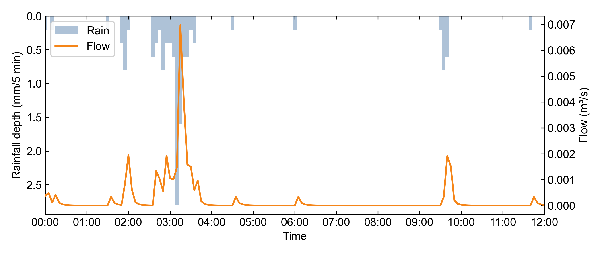

# Tecnopolo Prepared-Input Benchmark

This example is a compact external benchmark for the Agentic SWMM prepared-input workflow.
It is derived from the public Zenodo Tecnopolo SWMM dataset and trimmed to January 1994 so it can be committed and rerun quickly.

Source dataset:
- Zenodo: https://zenodo.org/records/19606749

## What This Benchmark Verifies

This case verifies the prepared-input path:

```text
external multi-subcatchment INP
-> swmm-runner
-> peak and continuity QA
-> direct swmm5 consistency check
-> rainfall-runoff plots
-> experiment audit
```

It does not verify raw GIS-to-INP generation for Tecnopolo, because the INP is externally supplied.

## Model Scope

The January 1994 prepared-input model contains:

| Component | Count |
| --- | ---: |
| Subcatchments | 40 |
| Junctions | 31 |
| Conduits | 31 |
| Outfalls | 2 |
| Raingages | 1 |

The rainfall file is a one-month 5-minute cumulative rainfall series.
Temperature and evaporation are daily external time series.

## Reproduce

From the repository root:

```bash
python3 scripts/benchmarks/run_tecnopolo_199401.py
```

The benchmark script uses the same module scripts described by the `swmm-end-to-end` prepared-input contract.
The MCP wrappers delegate to these module scripts, so this command is the portable local reproduction path for the same runner, QA, plot, and audit stages.

The script writes outputs under:

```text
runs/benchmarks/tecnopolo-199401-prepared/
```

Expected key metrics:

| Target | Metric | Expected |
| --- | --- | --- |
| `OUT_0` | Peak inflow | `0.061` CMS at `03:15` |
| `J22` | Peak inflow | `0.007` CMS at `03:15` |
| Runoff continuity | Error | `-0.130%` |
| Flow routing continuity | Error | `-0.004%` |

The direct `swmm5` baseline and `swmm-runner` output should produce identical binary `.out` files.
The text reports differ only in SWMM's analysis timestamp lines.

## Expected Artifacts

The benchmark produces:

```text
05_builder/model.inp
06_runner/model.rpt
06_runner/model.out
06_runner/manifest.json
07_qa/runner_peak.json
07_qa/runner_continuity.json
07_qa/direct_runner_consistency.json
07_qa/node_J22_validation.json
08_plot/rain_runoff_OUT_0.png
08_plot/rain_runoff_J22.png
10_direct/model.rpt
10_direct/model.out
manifest.json
experiment_provenance.json
comparison.json
experiment_note.md
```

## Evidence Summary

This benchmark demonstrates that the prepared-input workflow can execute and audit an external multi-subcatchment SWMM model, verify equivalence with direct SWMM execution, evaluate both outfall and internal-node peak metrics, and generate rainfall-runoff figures.

Outfall figure:


Internal junction figure:


